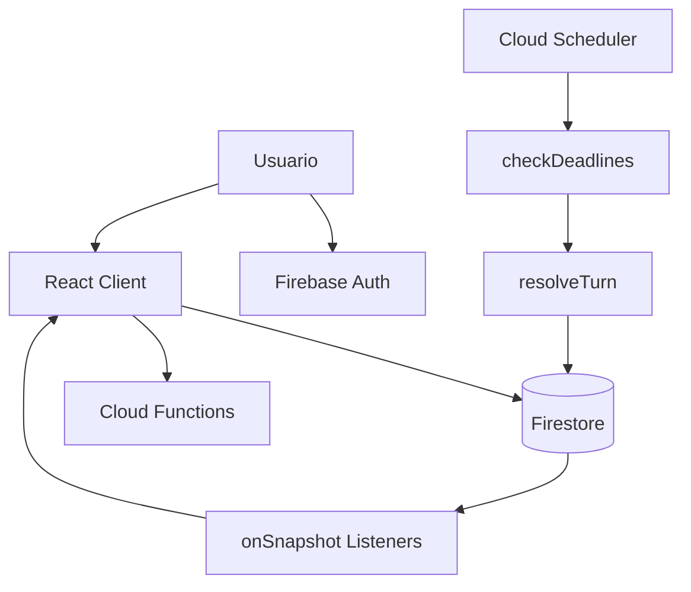
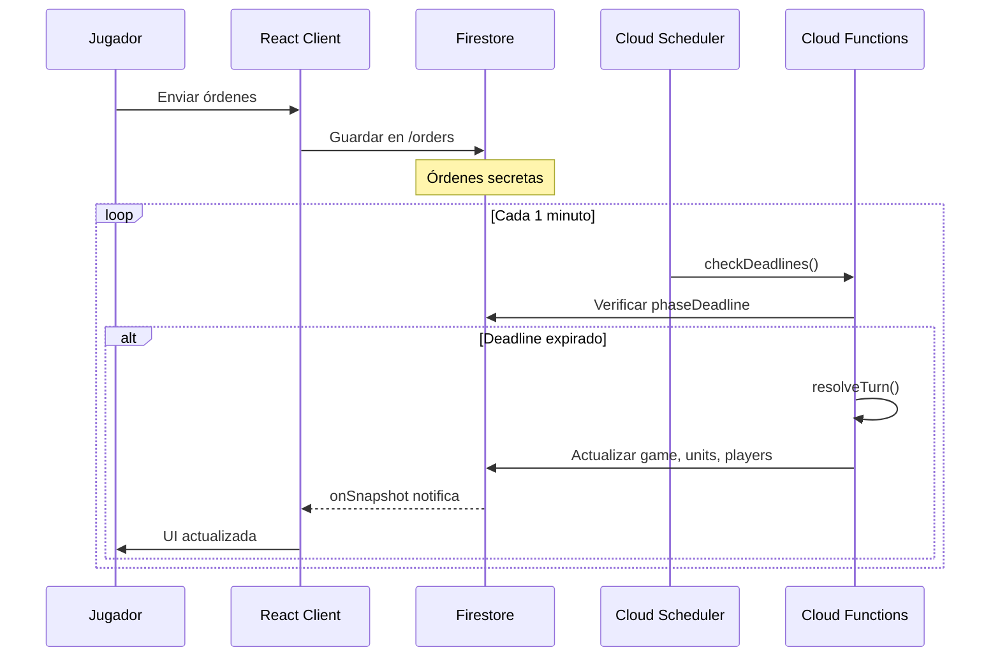
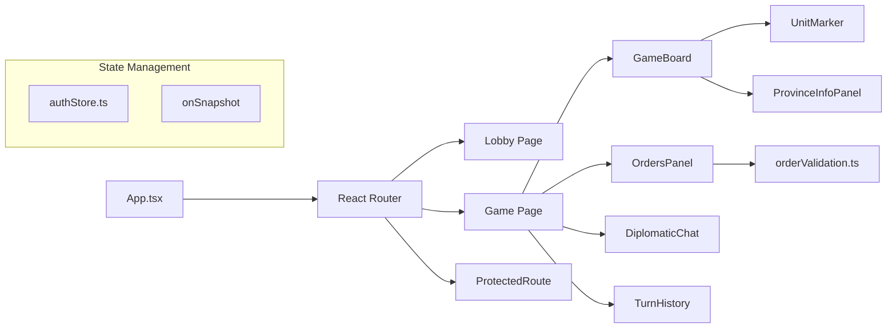
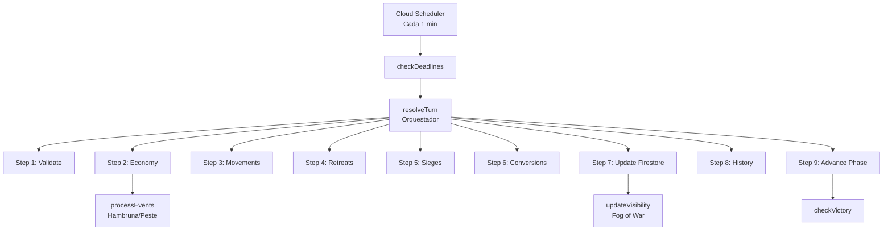
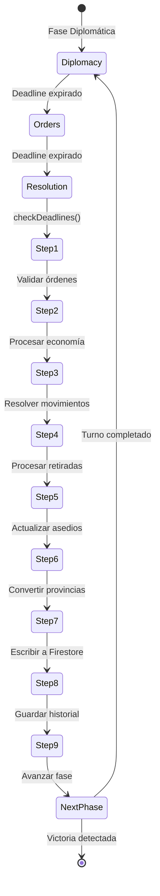
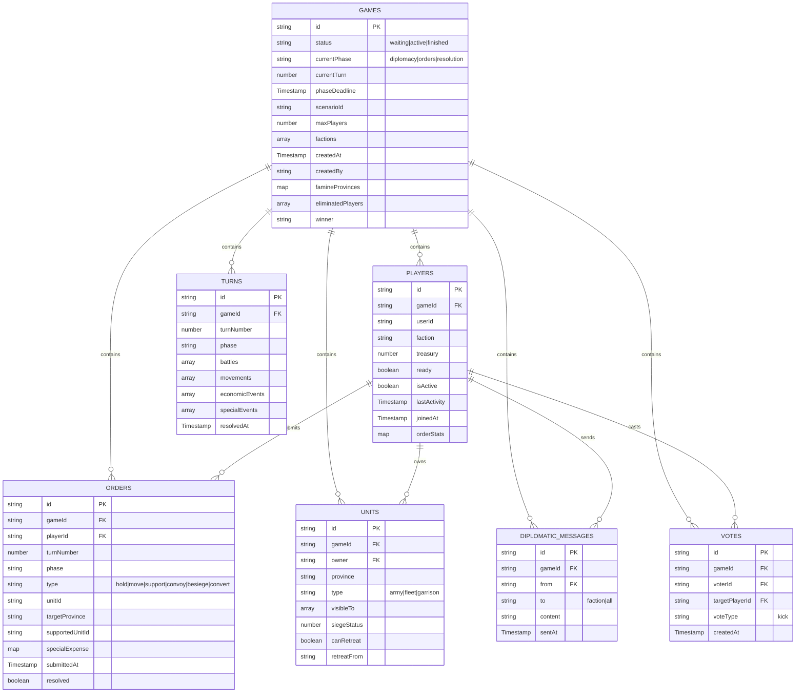
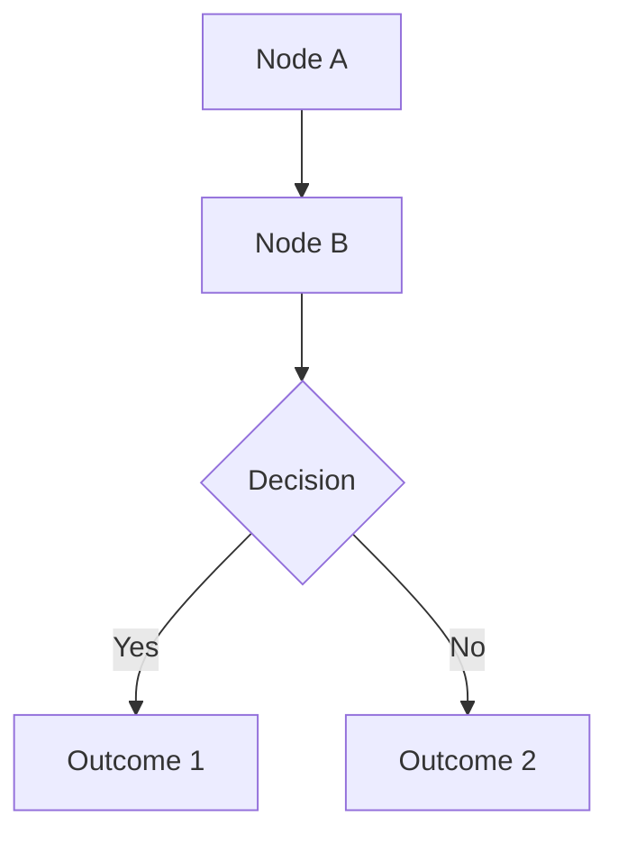

# Comando: Documentar Proyecto Completo

Analiza todo el código fuente del proyecto Machiavelli, compara con la documentación existente, y genera/actualiza toda la documentación técnica necesaria.

**IMPORTANTE:** Este comando debe ejecutarse de forma autónoma y exhaustiva. Lee TODOS los archivos necesarios para generar documentación precisa y actualizada.

---

## OBJETIVO

Mantener la documentación sincronizada con el código mediante:
1. Generación de documentación técnica faltante (arquitectura.md, database.md, glosario.md)
2. Documentación inline del código (JSDoc en componentes y utilidades)
3. Sincronización de código duplicado entre frontend/backend
4. Auditoría y actualización de documentación existente
5. Reporte de gaps y tareas pendientes

---

## PROCESO DE EJECUCIÓN

### FASE 1: ANÁLISIS COMPLETO DEL CÓDIGO

#### 1.1 Frontend (src/)
Lee y analiza TODOS estos archivos:

**Componentes (src/components/):**
- GameBoard.tsx, OrdersPanel.tsx, TurnIndicator.tsx, TurnHistory.tsx
- VictoryScreen.tsx, DiplomaticChat.tsx, FamineMitigationPanel.tsx
- InactivePlayerVoting.tsx, ProvinceInfoPanel.tsx, TreasuryPanel.tsx
- UnitMarker.tsx, UnitIcon.tsx
- Login.tsx, Register.tsx, ProtectedRoute.tsx
- GamesList.tsx, MyGamesList.tsx, CreateGameModal.tsx, JoinGameDialog.tsx

**Páginas (src/pages/):**
- Lobby.tsx, Game.tsx, MapTest.tsx

**Tipos (src/types/):**
- game.ts (COMPLETO - 180 líneas con Game, Player, Unit, Order, etc.)
- auth.ts, map.ts, index.ts

**Datos (src/data/):**
- factions.ts (7 facciones)
- provinceData.ts (74 provincias con adyacencias)
- provinceCoordinates.ts
- scenarios.ts (3 escenarios)

**Utilidades (src/utils/):**
- orderValidation.ts (validación cliente)
- provinceHelpers.ts

**Store (src/store/):**
- authStore.ts (Zustand)

**Configuración:**
- App.tsx, main.tsx, index.css
- src/lib/firebase.ts

#### 1.2 Backend (functions/src/)
Lee y analiza TODOS estos archivos:

**Funciones principales:**
- index.ts (exports)
- checkDeadlines.ts (scheduled cron)
- resolveTurn.ts (orquestador de 9 pasos)
- forcePhaseAdvance.ts (testing)

**Resolución de turnos (functions/src/resolution/):**
- step1-validate.ts (validación servidor)
- step2-economy.ts (economía y transferencias)
- step3-movements.ts (movimientos y batallas)
- step4-retreats.ts (retiradas)
- step5-sieges.ts (asedios)
- step6-conversions.ts (conversiones)
- step7-update.ts (batch writes)
- step8-history.ts (historial)
- step9-advance.ts (avanzar fase)
- checkVictory.ts, processInactiveVotes.ts

**Otros módulos:**
- events/processEvents.ts (hambruna, peste)
- visibility/updateVisibility.ts (fog of war)
- email/emailService.ts, emailTemplates.ts, notificationService.ts
- data/provinceData.ts (sync con frontend)
- types.ts (tipos backend)

#### 1.3 Configuración
Lee estos archivos:
- firestore.rules (security rules)
- firestore.indexes.json (índices)
- firebase.json (config)
- package.json (dependencias)
- vite.config.ts (alias)

#### 1.4 Documentación Existente
Lee TODA la documentación en docs/ para compararla con el código:
- docs/INDEX.md
- docs/user/* (MANUAL.md, QUICK_START.md, FAQ.md)
- docs/dev/* (CONTRIBUTING.md, DEPLOYMENT.md, API_REFERENCE.md, TESTING.md)
- docs/ops/* (MONITORING.md, TROUBLESHOOTING.md)
- docs/reference/* (TODOS los archivos de mecánicas y fases)

---

### FASE 2: GENERAR DOCUMENTACIÓN TÉCNICA FALTANTE

#### 2.1 Crear docs/reference/arquitectura.md

**Contenido requerido:**

```markdown
# Arquitectura del Proyecto Machiavelli

## Visión General

[Descripción general del sistema asíncrono basado en deadlines]

## Diagrama de Arquitectura General



## Stack Tecnológico

### Frontend
- **React 19.2.0** - UI framework
- **TypeScript 5.9.3** - Type safety
- **Vite 7.1.9** - Build tool
- **Tailwind CSS 4.1.14** - Styling
- **React Router 7.9.4** - Routing
- **Zustand 5.0.8** - State management
- **react-zoom-pan-pinch 3.7.0** - Mapa interactivo

### Backend
- **Firebase Authentication** - Autenticación de usuarios
- **Cloud Firestore** - Base de datos NoSQL
- **Cloud Functions** - Lógica servidor (Node.js 20)
- **Cloud Scheduler** - Cron jobs (1 minuto)
- **Firebase Hosting** - Hosting estático

### Desarrollo
- **Firebase Emulators** - Desarrollo local
- **ESLint + TypeScript** - Code quality

## Arquitectura Cliente-Servidor

### Flujo Asíncrono (Play-by-Mail)

[Explicar el modelo asíncrono basado en deadlines]



### Real-time Listeners

[Explicar patrón de listeners con onSnapshot]

```typescript
// Patrón estándar
useEffect(() => {
  const unsubscribe = onSnapshot(docRef, (snapshot) => {
    setData(snapshot.data())
  })
  return () => unsubscribe() // Cleanup importante
}, [dependencies])
```

## Componentes Principales

### Frontend Architecture



### Backend Architecture



## Ciclo de Vida de un Turno

[Explicar ciclo completo desde deadline hasta resolución]



## Patrones Importantes

### 1. Timestamps de Firebase

**SIEMPRE usa Timestamp de Firebase:**

```typescript
import { Timestamp } from 'firebase/firestore'

// ✓ Correcto
phaseDeadline: Timestamp.now()

// ✗ Incorrecto
phaseDeadline: new Date()
```

### 2. Real-time Listeners

```typescript
useEffect(() => {
  const unsubscribe = onSnapshot(docRef, (snapshot) => {
    setData(snapshot.data())
  })
  return () => unsubscribe() // Cleanup obligatorio
}, [deps])
```

### 3. Validación Dual (Cliente + Servidor)

**Cliente** (UX inmediata):
```typescript
// src/utils/orderValidation.ts
export function validateOrder(order, context) {
  // Validación rápida para feedback
}
```

**Servidor** (Autoridad):
```typescript
// functions/src/resolution/step1-validate.ts
export function validateOrders(orders, context) {
  // Validación definitiva
}
```

⚠️ **Deben estar sincronizados** - Ver CODE_SYNCHRONIZATION.md

### 4. Security Rules (Read-Only Game State)

Durante partida activa:
- **Jugadores**: Solo leen `games`, `units`, `players`
- **Cloud Functions**: Única autoridad que escribe
- **Jugadores**: Solo escriben `orders` y `diplomatic_messages`

Lobby (`status: 'waiting'`) tiene reglas más permisivas.

### 5. Path Alias

```typescript
import { Game } from '@/types'
import { db } from '@/lib/firebase'
```

Configurado en vite.config.ts.

## Flujo de Datos Completo

### Ejemplo: Jugador envía orden de Avanzar

1. **Cliente**: Jugador selecciona unidad y destino
2. **Cliente**: `orderValidation.ts` valida instantáneamente
3. **Cliente**: Si válida, guarda en Firestore `/orders`
4. **Firestore**: Orden guardada con `gameId`, `playerId`, `turnNumber`
5. **Scheduler**: Cada minuto ejecuta `checkDeadlines()`
6. **checkDeadlines**: Detecta `phaseDeadline` expirado
7. **resolveTurn**: Ejecuta 9 pasos de resolución
8. **Step 1**: Re-valida orden en servidor
9. **Step 3**: Resuelve movimiento (batallas, standoffs)
10. **Step 7**: Actualiza Firestore con batch writes
11. **Firestore**: Notifica cambios via `onSnapshot`
12. **Cliente**: React actualiza UI automáticamente

## Fog of War y Visibilidad

[Explicar sistema visibleTo en units]

```typescript
interface Unit {
  id: string
  gameId: string
  owner: string
  province: string
  type: 'army' | 'fleet' | 'garrison'
  visibleTo: string[] // ['florence', 'venice'] o ['all']
}
```

**Reglas de visibilidad:**
- Unidad visible a su owner siempre
- Visible a facciones adyacentes
- Garrison solo visible si provincia es tuya
- Actualizado en `updateVisibility()` después de cada turno

## Gestión de Eventos Especiales

### Hambruna (Spring)
- Ocurre si provincia no puede pagar mantenimiento
- Licencia tropas automáticamente
- Notificación a jugador

### Peste (Summer)
- Evento aleatorio en provincias con alta población
- Destruye guarniciones
- Reduce ingresos temporalmente

### Asesinatos
- Orden especial con coste en ducados
- Requiere validación de fondos
- Procesado en Step 2 (Economy)

## Escalabilidad y Performance

### Batch Writes
```typescript
// Step 7: Update
const batch = db.batch()
// Máximo 500 operaciones por batch
batch.update(gameRef, updates)
batch.set(unitRef, unitData)
await batch.commit()
```

### Índices Compuestos
Ver firestore.indexes.json:
- `games`: status + createdAt
- `units`: gameId + owner
- `orders`: gameId + turnNumber

### Timeouts
Cloud Functions configuradas con `timeoutSeconds: 540` (9 minutos)

## Testing

### Emulators
```bash
firebase emulators:start --only firestore,auth,functions
# UI: http://localhost:4000
```

### Testing Manual
1. Botón "⚡ Forzar Avance" (`forcePhaseAdvance`)
2. Múltiples usuarios (ventanas incógnito)
3. Verificar resolución en Emulator UI

## Deployment

```bash
# Orden recomendado
firebase deploy --only firestore:rules
firebase deploy --only firestore:indexes
firebase deploy --only functions
npm run build && firebase deploy --only hosting
```

## Monitoreo

Ver docs/ops/MONITORING.md para métricas y alertas.

## Referencias

- [Base de Datos](./database.md) - Esquema Firestore completo
- [API Reference](../dev/API_REFERENCE.md) - Cloud Functions detalladas
- [Glosario](./glosario.md) - Terminología técnica
```

---

#### 2.2 Crear docs/reference/database.md

**Contenido requerido:**

```markdown
# Esquema de Base de Datos - Firestore

## Visión General

Machiavelli usa Firestore con arquitectura **flat** (no colecciones anidadas). Todas las relaciones se manejan mediante el campo `gameId`.

## Diagrama Entidad-Relación



## Colecciones Detalladas

### 1. /games/{gameId}

**Propósito:** Estado global del juego, fase actual, y deadline.

**Campos:**

| Campo | Tipo | Descripción | Obligatorio |
|-------|------|-------------|-------------|
| `id` | string | ID del juego | ✅ |
| `status` | string | Estado: `waiting`, `active`, `finished` | ✅ |
| `currentPhase` | string | Fase: `diplomacy`, `orders`, `resolution` | ✅ |
| `currentTurn` | number | Número de turno (1-based) | ✅ |
| `phaseDeadline` | Timestamp | Deadline de fase actual | ✅ |
| `scenarioId` | string | ID del escenario | ✅ |
| `maxPlayers` | number | Máximo de jugadores | ✅ |
| `factions` | array | Facciones disponibles | ✅ |
| `createdAt` | Timestamp | Fecha de creación | ✅ |
| `createdBy` | string | User ID del creador | ✅ |
| `famineProvinces` | map | Provincias con hambruna: `{province: turns}` | ❌ |
| `eliminatedPlayers` | array | IDs de jugadores eliminados | ❌ |
| `winner` | string | Facción ganadora (solo si finished) | ❌ |

**Ejemplo:**
```json
{
  "id": "game-abc123",
  "status": "active",
  "currentPhase": "orders",
  "currentTurn": 3,
  "phaseDeadline": Timestamp(2025-01-15 14:00:00),
  "scenarioId": "ITALIA_1454",
  "maxPlayers": 5,
  "factions": ["FLORENCE", "VENICE", "MILAN", "NAPLES", "PAPAL"],
  "createdAt": Timestamp(2025-01-10 10:00:00),
  "createdBy": "user-xyz789",
  "famineProvinces": {
    "PISA": 2,
    "LUCCA": 1
  },
  "eliminatedPlayers": [],
  "winner": null
}
```

**Índices:**
- `status + createdAt` (compuesto) - Para listar juegos activos ordenados

**Security Rules:**
- **Read**: Authenticated users
- **Create**: Authenticated users (status debe ser 'waiting')
- **Update**: Solo si status='waiting' OR Cloud Functions (admin)

---

### 2. /players/{playerId}

**Propósito:** Estado del jugador: tesoro, facción, actividad.

**Campos:**

| Campo | Tipo | Descripción | Obligatorio |
|-------|------|-------------|-------------|
| `id` | string | ID del jugador | ✅ |
| `gameId` | string | ID del juego | ✅ |
| `userId` | string | User ID de Firebase Auth | ✅ |
| `faction` | string | Facción elegida | ✅ |
| `treasury` | number | Ducados actuales | ✅ |
| `ready` | boolean | Listo para siguiente fase | ✅ |
| `isActive` | boolean | Jugador activo (no eliminado ni kicked) | ✅ |
| `lastActivity` | Timestamp | Última actividad detectada | ✅ |
| `joinedAt` | Timestamp | Fecha de unión | ✅ |
| `orderStats` | map | Estadísticas: `{submitted, successful}` | ❌ |

**Ejemplo:**
```json
{
  "id": "player-def456",
  "gameId": "game-abc123",
  "userId": "user-xyz789",
  "faction": "FLORENCE",
  "treasury": 150,
  "ready": true,
  "isActive": true,
  "lastActivity": Timestamp(2025-01-15 13:45:00),
  "joinedAt": Timestamp(2025-01-10 10:30:00),
  "orderStats": {
    "submitted": 12,
    "successful": 10
  }
}
```

**Índices:**
- `gameId + joinedAt` (compuesto) - Para listar jugadores de un juego

**Security Rules:**
- **Read**: Jugadores del mismo gameId
- **Create**: Authenticated users (solo en lobby)
- **Update**: READ-ONLY durante juego activo (solo Cloud Functions)

---

### 3. /units/{unitId}

**Propósito:** Unidades militares (ejércitos, flotas, guarniciones).

**Campos:**

| Campo | Tipo | Descripción | Obligatorio |
|-------|------|-------------|-------------|
| `id` | string | ID de la unidad | ✅ |
| `gameId` | string | ID del juego | ✅ |
| `owner` | string | Facción propietaria | ✅ |
| `province` | string | Provincia actual | ✅ |
| `type` | string | Tipo: `army`, `fleet`, `garrison` | ✅ |
| `visibleTo` | array | Facciones que ven esta unidad | ✅ |
| `siegeStatus` | number | Progreso de asedio (0-3) | ❌ |
| `canRetreat` | boolean | Puede retirarse después de batalla | ❌ |
| `retreatFrom` | string | Provincia de origen de retirada | ❌ |

**Ejemplo:**
```json
{
  "id": "unit-ghi789",
  "gameId": "game-abc123",
  "owner": "FLORENCE",
  "province": "PISA",
  "type": "army",
  "visibleTo": ["FLORENCE", "LUCCA", "SIENA"],
  "siegeStatus": 0,
  "canRetreat": false
}
```

**Índices:**
- `gameId + owner` (compuesto) - Para listar unidades de un jugador

**Security Rules:**
- **Read**: Solo si la unidad es visible (`visibleTo` incluye tu facción o 'all')
- **Write**: READ-ONLY (solo Cloud Functions)

---

### 4. /orders/{orderId}

**Propósito:** Órdenes secretas de los jugadores.

**Campos:**

| Campo | Tipo | Descripción | Obligatorio |
|-------|------|-------------|-------------|
| `id` | string | ID de la orden | ✅ |
| `gameId` | string | ID del juego | ✅ |
| `playerId` | string | ID del jugador | ✅ |
| `turnNumber` | number | Turno de la orden | ✅ |
| `phase` | string | Fase: `orders`, `retreats` | ✅ |
| `type` | string | Tipo: `hold`, `move`, `support`, `convoy`, `besiege`, `convert` | ✅ |
| `unitId` | string | ID de la unidad | ✅ |
| `targetProvince` | string | Provincia destino (para move) | ❌ |
| `supportedUnitId` | string | Unidad apoyada (para support) | ❌ |
| `specialExpense` | map | Gasto especial: `{type, amount, target}` | ❌ |
| `submittedAt` | Timestamp | Fecha de envío | ✅ |
| `resolved` | boolean | Orden ya resuelta | ❌ |

**Ejemplo:**
```json
{
  "id": "order-jkl012",
  "gameId": "game-abc123",
  "playerId": "player-def456",
  "turnNumber": 3,
  "phase": "orders",
  "type": "move",
  "unitId": "unit-ghi789",
  "targetProvince": "LUCCA",
  "submittedAt": Timestamp(2025-01-15 13:30:00),
  "resolved": false
}
```

**Índices:**
- `gameId + turnNumber` (compuesto) - Para cargar órdenes de un turno

**Security Rules:**
- **Read**: Solo owner durante fase orders/retreats; todos después de resolución
- **Write**: Solo owner, solo durante fase correcta

---

### 5. /diplomatic_messages/{messageId}

**Propósito:** Mensajes diplomáticos entre jugadores.

**Campos:**

| Campo | Tipo | Descripción | Obligatorio |
|-------|------|-------------|-------------|
| `id` | string | ID del mensaje | ✅ |
| `gameId` | string | ID del juego | ✅ |
| `from` | string | Facción emisora | ✅ |
| `to` | string | Facción receptora o 'all' | ✅ |
| `content` | string | Contenido del mensaje | ✅ |
| `sentAt` | Timestamp | Fecha de envío | ✅ |

**Ejemplo:**
```json
{
  "id": "msg-mno345",
  "gameId": "game-abc123",
  "from": "FLORENCE",
  "to": "VENICE",
  "content": "Propongo alianza contra Milán",
  "sentAt": Timestamp(2025-01-15 12:00:00)
}
```

**Índices:**
- `gameId + sentAt` (compuesto) - Para ordenar mensajes cronológicamente

**Security Rules:**
- **Read**: Si eres `from`, `to`, o si `to='all'`
- **Write**: Authenticated users del gameId

---

### 6. /votes/{voteId}

**Propósito:** Votos para expulsar jugadores inactivos.

**Campos:**

| Campo | Tipo | Descripción | Obligatorio |
|-------|------|-------------|-------------|
| `id` | string | ID del voto | ✅ |
| `gameId` | string | ID del juego | ✅ |
| `voterId` | string | ID del votante | ✅ |
| `targetPlayerId` | string | ID del jugador objetivo | ✅ |
| `voteType` | string | Tipo: `kick` | ✅ |
| `createdAt` | Timestamp | Fecha de creación | ✅ |

**Ejemplo:**
```json
{
  "id": "vote-pqr678",
  "gameId": "game-abc123",
  "voterId": "player-def456",
  "targetPlayerId": "player-stu901",
  "voteType": "kick",
  "createdAt": Timestamp(2025-01-15 11:00:00)
}
```

**Security Rules:**
- **Read**: Jugadores del gameId
- **Write**: Jugadores activos del gameId

---

### 7. /turns/{turnId}

**Propósito:** Historial de turnos resueltos.

**Campos:**

| Campo | Tipo | Descripción | Obligatorio |
|-------|------|-------------|-------------|
| `id` | string | ID del turno | ✅ |
| `gameId` | string | ID del juego | ✅ |
| `turnNumber` | number | Número de turno | ✅ |
| `phase` | string | Fase resuelta | ✅ |
| `battles` | array | Batallas ocurridas | ❌ |
| `movements` | array | Movimientos exitosos | ❌ |
| `economicEvents` | array | Eventos económicos | ❌ |
| `specialEvents` | array | Hambruna, Peste, Asesinatos | ❌ |
| `resolvedAt` | Timestamp | Fecha de resolución | ✅ |

**Ejemplo:**
```json
{
  "id": "turn-vwx234",
  "gameId": "game-abc123",
  "turnNumber": 3,
  "phase": "orders",
  "battles": [
    {
      "province": "LUCCA",
      "attacker": "FLORENCE",
      "defender": "PISA",
      "winner": "FLORENCE",
      "attackerForce": 5,
      "defenderForce": 3
    }
  ],
  "movements": [
    {
      "unitId": "unit-ghi789",
      "from": "PISA",
      "to": "LUCCA",
      "success": true
    }
  ],
  "economicEvents": [],
  "specialEvents": [
    {
      "type": "FAMINE",
      "province": "SIENA",
      "details": "Licenciada 1 tropa por falta de fondos"
    }
  ],
  "resolvedAt": Timestamp(2025-01-15 14:01:00)
}
```

**Security Rules:**
- **Read**: Jugadores del gameId
- **Write**: READ-ONLY (solo Cloud Functions)

---

## Relaciones

### Por gameId (Todas las colecciones)

```typescript
// Obtener todos los jugadores de un juego
const playersQuery = query(
  collection(db, 'players'),
  where('gameId', '==', gameId)
)

// Obtener todas las unidades de un juego
const unitsQuery = query(
  collection(db, 'units'),
  where('gameId', '==', gameId)
)
```

### Por owner (Units)

```typescript
// Obtener unidades de un jugador
const myUnitsQuery = query(
  collection(db, 'units'),
  where('gameId', '==', gameId),
  where('owner', '==', myFaction)
)
```

### Por turnNumber (Orders)

```typescript
// Obtener órdenes del turno actual
const ordersQuery = query(
  collection(db, 'orders'),
  where('gameId', '==', gameId),
  where('turnNumber', '==', currentTurn)
)
```

---

## Índices Compuestos

Definidos en `firestore.indexes.json`:

```json
[
  {
    "collectionGroup": "games",
    "queryScope": "COLLECTION",
    "fields": [
      { "fieldPath": "status", "order": "ASCENDING" },
      { "fieldPath": "createdAt", "order": "DESCENDING" }
    ]
  },
  {
    "collectionGroup": "players",
    "queryScope": "COLLECTION",
    "fields": [
      { "fieldPath": "gameId", "order": "ASCENDING" },
      { "fieldPath": "joinedAt", "order": "ASCENDING" }
    ]
  },
  {
    "collectionGroup": "units",
    "queryScope": "COLLECTION",
    "fields": [
      { "fieldPath": "gameId", "order": "ASCENDING" },
      { "fieldPath": "owner", "order": "ASCENDING" }
    ]
  },
  {
    "collectionGroup": "orders",
    "queryScope": "COLLECTION",
    "fields": [
      { "fieldPath": "gameId", "order": "ASCENDING" },
      { "fieldPath": "turnNumber", "order": "ASCENDING" }
    ]
  },
  {
    "collectionGroup": "diplomaticMessages",
    "queryScope": "COLLECTION",
    "fields": [
      { "fieldPath": "gameId", "order": "ASCENDING" },
      { "fieldPath": "sentAt", "order": "DESCENDING" }
    ]
  }
]
```

---

## Security Rules

Ver `firestore.rules` para reglas completas.

### Principios Clave

1. **Games/Units/Players son READ-ONLY durante juego activo**
   - Solo Cloud Functions (Admin SDK) pueden modificar

2. **Orders son secretas durante fase de órdenes**
   - Solo el owner puede leer sus propias órdenes
   - Visibles a todos después de resolución

3. **Fog of War en Units**
   - Campo `visibleTo` controla visibilidad
   - Security rules verifican que tu facción esté en `visibleTo`

4. **Lobby es más permisivo**
   - Jugadores pueden unirse/salir
   - Jugadores pueden actualizar ready status

---

## Migraciones

⚠️ **No hay sistema de migraciones automáticas.**

Para cambios de esquema:
1. Actualizar tipos en `src/types/game.ts` y `functions/src/types.ts`
2. Actualizar security rules en `firestore.rules`
3. Actualizar índices en `firestore.indexes.json`
4. Desplegar: `firebase deploy --only firestore:rules,firestore:indexes`
5. Migración manual de datos existentes (si necesario)

---

## Queries Comunes

### Listar juegos activos

```typescript
const activeGamesQuery = query(
  collection(db, 'games'),
  where('status', '==', 'active'),
  orderBy('createdAt', 'desc')
)
```

### Obtener mis partidas

```typescript
const myPlayersQuery = query(
  collection(db, 'players'),
  where('userId', '==', currentUser.uid),
  where('isActive', '==', true)
)
// Luego cargar games por gameId
```

### Real-time game state

```typescript
// Suscribirse a cambios del juego
useEffect(() => {
  const gameRef = doc(db, 'games', gameId)
  const unsubscribe = onSnapshot(gameRef, (snapshot) => {
    setGame(snapshot.data() as Game)
  })
  return () => unsubscribe()
}, [gameId])
```

---

## Performance

### Batch Writes

Máximo **500 operaciones** por batch:

```typescript
const batch = db.batch()
batch.update(gameRef, gameUpdates)
batch.set(unitRef, unitData)
await batch.commit()
```

### Pagination

Para listas largas:

```typescript
const gamesQuery = query(
  collection(db, 'games'),
  orderBy('createdAt', 'desc'),
  limit(20),
  startAfter(lastVisible)
)
```

### Listeners Cleanup

**SIEMPRE limpia listeners:**

```typescript
useEffect(() => {
  const unsubscribe = onSnapshot(...)
  return () => unsubscribe() // Evita memory leaks
}, [])
```

---

## Referencias

- [Arquitectura](./arquitectura.md) - Flujo completo del sistema
- [API Reference](../dev/API_REFERENCE.md) - Cloud Functions
- [Security Rules](../../firestore.rules) - Reglas completas
```

---

#### 2.3 Crear docs/reference/glosario.md

**Contenido requerido:**

Términos de juego (Mantener, Avanzar, Apoyar, etc.) y conceptos técnicos (Standoff, Cut support, Convoy, etc.) organizados alfabéticamente.

[Generar glosario completo basándote en la documentación existente en docs/reference/ y términos encontrados en el código]

---

### FASE 3: DOCUMENTAR CÓDIGO FUENTE

#### 3.1 Añadir JSDoc a Componentes Principales

Para cada componente en src/components/, añadir:

```typescript
/**
 * [Descripción del componente]
 *
 * @component
 * @example
 * <ComponentName prop1="value" />
 */

/**
 * Props para [ComponentName]
 */
interface ComponentNameProps {
  /** [Descripción de prop1] */
  prop1: string
  /** [Descripción de prop2] */
  prop2?: number
}
```

**Componentes prioritarios:**
1. GameBoard.tsx
2. OrdersPanel.tsx
3. DiplomaticChat.tsx
4. TurnHistory.tsx
5. TreasuryPanel.tsx
6. ProvinceInfoPanel.tsx
7. UnitMarker.tsx

#### 3.2 Documentar Utilidades

Añadir JSDoc a funciones en:
- src/utils/orderValidation.ts
- src/utils/provinceHelpers.ts

```typescript
/**
 * [Descripción de la función]
 *
 * @param param1 - [Descripción]
 * @param param2 - [Descripción]
 * @returns [Qué devuelve]
 * @throws {Error} [Cuándo lanza error]
 * @example
 * validateOrder(order, context)
 */
```

#### 3.3 Mejorar Documentación de Tipos

En src/types/game.ts, añadir comentarios explicativos a interfaces complejas.

---

### FASE 4: SINCRONIZACIÓN DE CÓDIGO

#### 4.1 Crear docs/dev/CODE_SYNCHRONIZATION.md

**Contenido:**

```markdown
# Guía de Sincronización de Código

Este documento explica qué código está duplicado entre frontend y backend, por qué, y cómo mantenerlo sincronizado.

## Código Duplicado

### 1. Tipos (Game, Player, Unit, Order)

**Frontend:** `src/types/game.ts`
**Backend:** `functions/src/types.ts`

**Diferencia clave:**
- Frontend usa `Timestamp` de `firebase/firestore`
- Backend usa `Timestamp` de `firebase-admin/firestore`

**Por qué existe:**
- Cloud Functions usan Admin SDK
- Cliente usa SDK normal
- Misma estructura, diferentes imports

**Cómo sincronizar:**
1. Al añadir campo, actualizar AMBOS archivos
2. Ejecutar TypeScript check en ambos: `npm run build` y `cd functions && npm run build`
3. Verificar tests si existen

**Campos únicos del backend:**
- `siegeStatus` (solo usado internamente)
- `famineProvinces` (solo en Game backend)

---

### 2. Datos de Provincias

**Frontend:** `src/data/provinceData.ts`
**Backend:** `functions/src/data/provinceData.ts`

**Contenido:**
- PROVINCE_ADJACENCIES (74 provincias)
- PROVINCE_INFO (tipo, puerto, capital)
- Helpers: isAdjacent(), isPort(), etc.

**Por qué existe:**
- Cliente valida movimientos antes de enviar
- Servidor re-valida definitivamente
- Necesitan mismo mapa de adyacencias

**Cómo sincronizar:**
1. Archivo maestro: `src/data/provinceData.ts`
2. Al añadir/modificar provincia, copiar a backend
3. Ejecutar tests de validación en ambos lados
4. Verificar que helpers funcionen igual

---

### 3. Validación de Órdenes

**Frontend:** `src/utils/orderValidation.ts`
**Backend:** `functions/src/resolution/step1-validate.ts`

**Diferencia clave:**
- Cliente: Validación rápida para UX
- Servidor: Validación exhaustiva con contexto completo

**Por qué existe:**
- UX requiere feedback instantáneo
- Servidor es autoridad definitiva
- No se puede confiar en cliente (seguridad)

**Cómo sincronizar:**
1. Lógica de validación debe ser IDÉNTICA
2. Al añadir tipo de orden, actualizar AMBOS
3. Al cambiar regla, actualizar AMBOS
4. Ejemplo: Si cambias cuándo es válido besiege, actualizar cliente y servidor

**Casos especiales:**
- Servidor tiene acceso a toda la DB (puede validar más)
- Cliente solo tiene su contexto (validación limitada)
- Si hay conflicto, servidor gana siempre

---

## Checklist de Sincronización

Ejecuta esto antes de cada deploy:

### Tipos
- [ ] `Game` interface sincronizada
- [ ] `Player` interface sincronizada
- [ ] `Unit` interface sincronizada
- [ ] `Order` interface sincronizada
- [ ] Timestamp imports correctos

### Provincias
- [ ] PROVINCE_ADJACENCIES idéntico
- [ ] PROVINCE_INFO idéntico
- [ ] Helpers funcionan igual
- [ ] 74 provincias presentes

### Validación
- [ ] validateHoldOrder() igual lógica
- [ ] validateMoveOrder() igual lógica
- [ ] validateSupportOrder() igual lógica
- [ ] validateConvoyOrder() igual lógica
- [ ] validateBesiegeOrder() igual lógica
- [ ] validateConvertOrder() igual lógica

### Testing
- [ ] `npm run build` sin errores
- [ ] `cd functions && npm run build` sin errores
- [ ] Tests manuales en emulators

---

## Herramientas Recomendadas

### Diff Visual
```bash
# Comparar tipos
diff src/types/game.ts functions/src/types.ts

# Comparar provincias
diff src/data/provinceData.ts functions/src/data/provinceData.ts
```

### Script de Verificación (Futuro)

Crear `scripts/verify-sync.ts` que:
1. Compara estructuras de tipos
2. Verifica provincias son idénticas
3. Lanza warning si hay diferencias

---

## Migración Futura

**Opción 1: Monorepo**
- Mover tipos compartidos a `/shared`
- Frontend y backend importan desde shared

**Opción 2: NPM Package**
- Publicar `@machiavelli/types` package
- Instalar en ambos proyectos

**Por ahora:** Sincronización manual con checklist.
```

---

### FASE 5: AUDITORÍA DE DOCUMENTACIÓN EXISTENTE

#### 5.1 Revisar Documentos de Fases

Compara estos 5 documentos y detecta inconsistencias:
- docs/reference/fase-diplomatica.md
- docs/reference/fase-ordenes.md
- docs/reference/fase-resolucion.md
- docs/reference/fases-overview.md
- docs/reference/GAME_PHASES.md

Si hay información contradictoria o duplicada, **anótalo en el reporte** pero NO modifiques (puede ser intencional).

#### 5.2 Actualizar API_REFERENCE.md

Lee `functions/src/index.ts` y verifica que todas las funciones exportadas estén documentadas en `docs/dev/API_REFERENCE.md`. Si falta alguna, añádela.

#### 5.3 Actualizar CONTRIBUTING.md

Añade referencias a los nuevos documentos (arquitectura.md, database.md) en la sección de "Documentación Técnica".

---

### FASE 6: GENERAR REPORTES

#### 6.1 Terminal Output

Genera un resumen conciso en markdown:

```markdown
# 📚 Documentación Actualizada

## ✅ Documentos Creados
- docs/reference/arquitectura.md (850 líneas, 4 diagramas Mermaid)
- docs/reference/database.md (720 líneas, 1 diagrama ER)
- docs/reference/glosario.md (120 términos)
- docs/dev/CODE_SYNCHRONIZATION.md (200 líneas)

## 🔄 Documentos Actualizados
- docs/INDEX.md (añadidos 3 enlaces)
- docs/dev/API_REFERENCE.md (añadida función X)
- docs/dev/CONTRIBUTING.md (añadida sección de arquitectura)
- [Lista de componentes con JSDoc añadido]

## ⚠️ Inconsistencias Encontradas
- [Listar inconsistencias entre docs de fases]
- [Listar diferencias entre tipos frontend/backend]
- [Listar provincias desincronizadas si las hay]

## 📊 Estadísticas
- Total líneas añadidas: ~3500
- Archivos creados: 4
- Archivos modificados: 15
- Diagramas Mermaid: 5
- Componentes documentados: 12
- Utilidades documentadas: 8

## 🎯 Próximos Pasos
Ver DOCUMENTATION_CHECKLIST.md para tareas manuales pendientes.
```

#### 6.2 Crear DOCUMENTATION_CHECKLIST.md

Lista de tareas que requieren acción manual:

```markdown
# Checklist de Documentación Pendiente

## Alta Prioridad

- [ ] **Verificar diagramas Mermaid** - Revisar que los diagramas en arquitectura.md sean precisos
- [ ] **Validar glosario** - Confirmar que términos de juego usen nomenclatura oficial
- [ ] **Sincronizar tipos** - Verificar manualmente que Game/Player/Unit/Order estén sincronizados
- [ ] **Testing de validación** - Confirmar que orderValidation.ts (cliente) y step1-validate.ts (servidor) tengan misma lógica

## Media Prioridad

- [ ] **Revisar JSDoc añadido** - Verificar que descripciones de componentes sean claras
- [ ] **Consolidar docs de fases** - Decidir si mantener 5 documentos o consolidar
- [ ] **Añadir ejemplos de código** - Mejorar ejemplos en arquitectura.md
- [ ] **Capturas de pantalla** - Añadir screenshots a MANUAL.md y QUICK_START.md

## Baja Prioridad

- [ ] **TypeDoc autogenerado** - Considerar añadir generación automática de API docs
- [ ] **Storybook** - Considerar añadir Storybook para componentes
- [ ] **Diagramas PlantUML** - Considerar reemplazar Mermaid por PlantUML si se necesita más detalle
- [ ] **Internacionalización** - Considerar docs en inglés

## Seguimiento

- [ ] **Actualizar CHANGELOG.md** - Documentar cambios de documentación
- [ ] **Commit de documentación** - Crear commit específico para estos cambios
- [ ] **Review con equipo** - Revisar nuevos docs con otros desarrolladores

---

**Creado:** [Fecha]
**Por:** Claude Code (comando /documenta)
```

---

### FASE 7: ACTUALIZAR ÍNDICE

#### 7.1 Actualizar docs/INDEX.md

Añade enlaces a los nuevos documentos en la sección apropiada:

```markdown
### Referencia Técnica (docs/reference/)
- **[Arquitectura](reference/arquitectura.md)** - Diseño completo del sistema [NUEVO]
- **[Base de Datos](reference/database.md)** - Esquema Firestore [NUEVO]
- **[Glosario](reference/glosario.md)** - Términos oficiales [NUEVO]
- ...
```

```markdown
### Para Desarrolladores (docs/dev/)
- ...
- **[Sincronización de Código](dev/CODE_SYNCHRONIZATION.md)** - Guía de sync frontend/backend [NUEVO]
```

---

## DIRECTRICES DE EJECUCIÓN

### Calidad de Documentación

1. **Precisión Técnica**: Documenta EXACTAMENTE lo que hace el código, no lo que debería hacer
2. **Ejemplos Reales**: Usa ejemplos del código real, no inventados
3. **Diagramas Mermaid**: Usa sintaxis correcta y verifica que renderizan
4. **Consistencia**: Usa misma terminología que docs existentes
5. **Completitud**: Lee TODOS los archivos relevantes, no asumas

### Diagramas Mermaid

**Tipos recomendados:**
- `graph TB` - Diagramas de flujo
- `sequenceDiagram` - Interacciones temporales
- `erDiagram` - Relaciones de base de datos
- `stateDiagram-v2` - Máquinas de estado

**Sintaxis:**


### JSDoc

**Formato estándar:**
```typescript
/**
 * Brief description
 *
 * Longer description if needed
 *
 * @param param1 - Description
 * @returns Description
 * @throws {ErrorType} When it throws
 * @example
 * functionName(arg1, arg2)
 */
```

### Manejo de Inconsistencias

Si encuentras código duplicado con diferencias:
1. **Documenta la diferencia** en CODE_SYNCHRONIZATION.md
2. **Explica el por qué** (si es obvio)
3. **NO modifiques** el código sin permiso
4. **Añade a checklist** si requiere acción manual

---

## OUTPUT FINAL

Al terminar, muestra en terminal:
1. **Resumen ejecutivo** (formato markdown conciso)
2. **Ruta a DOCUMENTATION_CHECKLIST.md**
3. **Estadísticas clave**

**NO mostrar:**
- Contenido completo de archivos generados
- Logs verbosos del proceso
- Advertencias menores

---

## RESTRICCIONES

1. **NO modificar** docs/user/ (manual de usuario) a menos que haya error crítico
2. **NO modificar** docs/archive/ (archivo histórico)
3. **NO modificar** código fuente más allá de añadir JSDoc
4. **NO inventar** información no presente en el código
5. **NO asumir** comportamiento no verificado en el código

---

## EJECUCIÓN

Procede con las 7 fases en orden. Lee TODOS los archivos mencionados antes de generar documentación. Sé exhaustivo y preciso.

**¡Comienza ahora!**
