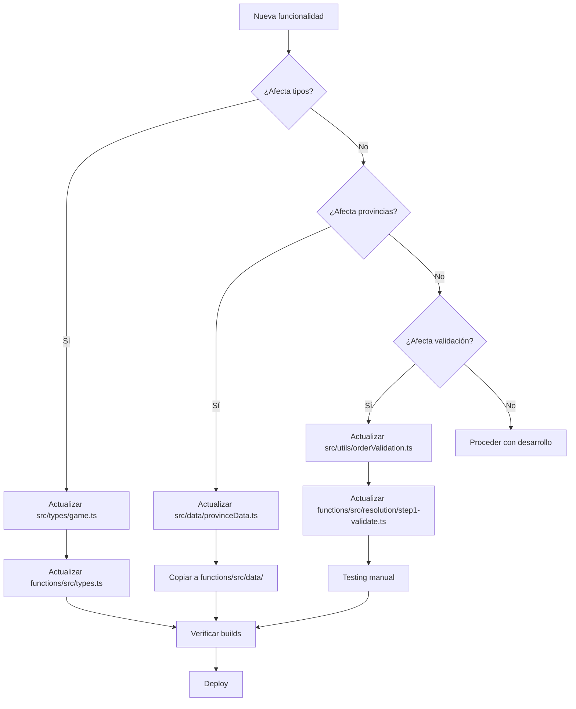

# Guía de Sincronización de Código

## Introducción

Este documento explica qué código está duplicado entre frontend y backend, **por qué existe esta duplicación**, y **cómo mantenerlo sincronizado** para evitar inconsistencias.

⚠️ **CRÍTICO:** La validación de órdenes y datos de provincias DEBEN estar sincronizados entre cliente y servidor. Divergencias causan bugs difíciles de detectar.

---

## Código Duplicado

### 1. Tipos (Game, Player, Unit, Order)

**Frontend:** `src/types/game.ts` (221 líneas)
**Backend:** `functions/src/types.ts` (133 líneas)

#### Diferencias Clave

**Imports de Timestamp:**
```typescript
// Frontend
import { Timestamp } from 'firebase/firestore'

// Backend
import * as admin from 'firebase-admin'
// Usa: admin.firestore.Timestamp
```

**Diferencias de estructura:**

| Tipo | Frontend | Backend | Diferencia |
|------|----------|---------|------------|
| **Game** | Completo (86 líneas) | Simplificado | Backend tiene `eventsConfig`, `siegeStatus`, `famineProvinces` |
| **Player** | Completo (25 líneas) | Simplificado | Frontend tiene más campos de UI |
| **Unit** | Completo (13 líneas) | Simplificado | Misma estructura |
| **Order** | `OrdersDocument` (8 líneas) | `Order` individual | Frontend agrupa órdenes por jugador |

#### Por qué existe

- **Cloud Functions usan Admin SDK** → Diferentes imports
- **Cliente usa SDK normal** → Diferentes imports
- **Misma estructura lógica** → Compatibilidad de datos
- **Campos extras en backend** → Estado interno de resolución

#### Cómo sincronizar

**Cuando añades un nuevo campo a Game:**

1. Actualizar `src/types/game.ts`:
   ```typescript
   export interface Game {
     // ... campos existentes
     newField: string  // ✅ Nuevo campo
   }
   ```

2. Actualizar `functions/src/types.ts`:
   ```typescript
   export interface Game {
     // ... campos existentes
     newField: string;  // ✅ Mismo campo
   }
   ```

3. Verificar:
   ```bash
   npm run build                    # Frontend
   cd functions && npm run build    # Backend
   ```

#### Campos únicos del backend

Estos campos SOLO existen en backend (no sincronizar):

- `Game.siegeStatus` - Estado interno de asedios
- `Game.famineProvinces` - Provincias con hambruna activa
- `Game.eventsConfig` - Configuración de eventos

---

### 2. Datos de Provincias

**Frontend:** `src/data/provinceData.ts` (288 líneas)
**Backend:** `functions/src/data/provinceData.ts` (288 líneas)

#### Contenido

```typescript
// Mapa de adyacencias (74 provincias)
export const PROVINCE_ADJACENCIES: Record<string, string[]> = {
  FLO: ['PIS', 'PIT', 'BOL', 'URB', 'ARE', 'SIE'],
  VEN: ['UA', 'PAD', 'TRE', 'FRI'],
  // ... 72 provincias más
}

// Información de provincias
export const PROVINCE_INFO: Record<string, ProvinceInfo> = {
  FLO: {
    id: 'FLO',
    name: 'Florence',
    type: 'land',
    adjacencies: PROVINCE_ADJACENCIES.FLO,
    hasCity: true,
    cityName: 'Florence',
    income: 5
  },
  // ... 73 provincias más
}

// Helpers
export const isAdjacent = (a: string, b: string): boolean => { ... }
export const isPort = (provinceId: string): boolean => { ... }
export const isLand = (provinceId: string): boolean => { ... }
export const isSea = (provinceId: string): boolean => { ... }
```

#### Por qué existe

- **Cliente valida movimientos antes de enviar** → UX inmediata
- **Servidor re-valida definitivamente** → Seguridad
- **Necesitan mismo mapa de adyacencias** → Consistencia

#### Cómo sincronizar

**Archivo maestro:** `src/data/provinceData.ts` (frontend es fuente de verdad)

**Al añadir/modificar provincia:**

1. Editar `src/data/provinceData.ts`:
   ```typescript
   // Añadir nueva adyacencia
   PROVINCE_ADJACENCIES.FLO = [...existentes, 'NEW_PROVINCE']
   ```

2. Copiar TODO el archivo a backend:
   ```bash
   cp src/data/provinceData.ts functions/src/data/provinceData.ts
   ```

3. Ajustar sintaxis TypeScript si necesario:
   - Frontend: `export const`
   - Backend: `export const` (mismo)

4. Verificar:
   ```bash
   npm run build
   cd functions && npm run build
   ```

#### Verificación

**Script de verificación manual:**

```bash
# Comparar archivos
diff src/data/provinceData.ts functions/src/data/provinceData.ts

# Debe mostrar SOLO diferencias de imports (si hay)
# Si muestra diferencias en PROVINCE_ADJACENCIES → ⚠️ DESINCRONIZADO
```

**Indicadores de desincronización:**

- ✅ Imports diferentes → OK
- ⚠️ PROVINCE_ADJACENCIES diferentes → PROBLEMA
- ⚠️ PROVINCE_INFO diferentes → PROBLEMA
- ⚠️ Helpers diferentes → PROBLEMA

---

### 3. Validación de Órdenes

**Frontend:** `src/utils/orderValidation.ts` (256 líneas)
**Backend:** `functions/src/resolution/step1-validate.ts` (170 líneas)

#### Diferencia clave

| Aspecto | Cliente | Servidor |
|---------|---------|----------|
| **Propósito** | UX inmediata | Autoridad definitiva |
| **Contexto** | Limitado (solo unidades visibles) | Completo (toda la DB) |
| **Validación** | Rápida, superficial | Exhaustiva, con contexto completo |
| **Consecuencia error** | Muestra error en UI | Cambia orden a "Mantener" |

#### Por qué existe

1. **UX requiere feedback instantáneo**
   - Jugador no debe esperar resolución para saber si orden es válida
   - Validación cliente previene errores comunes

2. **Servidor es autoridad definitiva**
   - No se puede confiar en cliente (seguridad)
   - Servidor tiene contexto completo
   - Previene cheating

3. **No se puede confiar en cliente**
   - Jugador podría modificar código cliente
   - Servidor siempre re-valida

#### Estructura de validación

**Cliente:**
```typescript
export const validateOrder = (
  map: GameMap,
  order: Order,
  unit: Unit,
  allUnits: Unit[]
): ValidationResult => {
  switch (order.action) {
    case 'hold':
      return validateHoldOrder()
    case 'move':
      return validateMoveOrder(map, order, unit)
    // ... más casos
  }
}
```

**Servidor:**
```typescript
export async function validateOrders(context: ResolutionContext): Promise<void> {
  for (const order of context.orders) {
    const unit = context.units.find(u => u.id === order.unitId)
    const validation = validateOrder(context.map, order, unit, context.units)

    if (!validation.isValid) {
      // Cambiar a "Mantener"
      order.action = 'hold'
      context.events.push({ type: 'invalid_order', ... })
    }
  }
}
```

#### Reglas de validación (DEBEN ser idénticas)

**1. Validación de MOVE:**

```typescript
// Frontend y Backend DEBEN tener esta lógica idéntica
if (order.action === 'move') {
  // Guarniciones no pueden moverse
  if (unit.type === 'garrison') {
    return { isValid: false, error: 'Las guarniciones no pueden moverse' }
  }

  // Verificar adyacencia
  if (!isAdjacent(map, unit.currentPosition, order.targetProvince)) {
    return { isValid: false, error: 'Provincia no es adyacente' }
  }

  // Ejércitos: solo tierra o puertos
  if (unit.type === 'army') {
    if (!isLand(map, order.targetProvince) && !isPort(map, order.targetProvince)) {
      return { isValid: false, error: 'Ejércitos no pueden ir a zona marítima sin convoy' }
    }
  }

  // Flotas: solo mar o puertos
  if (unit.type === 'fleet') {
    if (!isSea(map, order.targetProvince) && !isPort(map, order.targetProvince)) {
      return { isValid: false, error: 'Flotas solo pueden moverse al mar o puertos' }
    }
  }

  return { isValid: true }
}
```

**2. Validación de SUPPORT:**

```typescript
// Frontend y Backend DEBEN validar igual
if (order.action === 'support') {
  if (!order.supportedUnit) {
    return { isValid: false, error: 'Debe especificar unidad a apoyar' }
  }

  const supportedUnit = allUnits.find(u => u.id === order.supportedUnit)
  if (!supportedUnit) {
    return { isValid: false, error: 'Unidad a apoyar no encontrada' }
  }

  if (!isAdjacent(map, unit.currentPosition, supportedUnit.currentPosition)) {
    return { isValid: false, error: 'No puedes apoyar esa provincia (no es adyacente)' }
  }

  return { isValid: true }
}
```

**3. Validación de BESIEGE:**

```typescript
// Frontend y Backend DEBEN validar igual
if (order.action === 'besiege') {
  if (unit.type === 'garrison') {
    return { isValid: false, error: 'Las guarniciones no pueden asediar' }
  }

  if (unit.currentPosition !== order.targetProvince) {
    return { isValid: false, error: 'Debes estar en la provincia de la ciudad para asediarla' }
  }

  const provinceInfo = getProvinceInfo(map, order.targetProvince)
  if (!provinceInfo?.hasCity) {
    return { isValid: false, error: 'La provincia no tiene ciudad para asediar' }
  }

  return { isValid: true }
}
```

#### Cómo sincronizar

**Cuando cambias lógica de validación:**

1. ⚠️ **SIEMPRE actualizar AMBOS archivos**

2. Editar `src/utils/orderValidation.ts`:
   ```typescript
   // Nueva regla
   if (nuevaCondicion) {
     return { isValid: false, error: 'Mensaje' }
   }
   ```

3. Editar `functions/src/resolution/step1-validate.ts`:
   ```typescript
   // MISMA regla
   if (nuevaCondicion) {
     return { isValid: false, error: 'Mensaje' }
   }
   ```

4. Verificar con testing manual:
   - Crear partida en emulators
   - Intentar orden que debería fallar
   - Verificar que falla en cliente Y en servidor

#### Casos especiales

**Servidor puede validar más que cliente:**

```typescript
// Backend puede verificar contexto completo
if (targetProvince.owner !== unit.owner && targetProvince.garrisonStrength > 5) {
  return { isValid: false, error: 'Ciudad demasiado fortificada' }
}

// Cliente NO tiene esta información (fog of war)
// Entonces cliente permite, pero servidor rechaza
```

**Regla:** Si hay conflicto, **servidor gana siempre**.

---

## Checklist de Sincronización

### Pre-Deploy Checklist

Ejecuta esto antes de cada deploy a producción:

#### Tipos ✅

- [ ] `Game` interface sincronizada
- [ ] `Player` interface sincronizada
- [ ] `Unit` interface sincronizada
- [ ] `Order` interface sincronizada
- [ ] Timestamp imports correctos (firebase vs firebase-admin)

#### Provincias ✅

- [ ] PROVINCE_ADJACENCIES idéntico
- [ ] PROVINCE_INFO idéntico
- [ ] Helpers (`isAdjacent`, `isPort`, etc.) funcionan igual
- [ ] 74 provincias presentes en ambos archivos

#### Validación ✅

- [ ] `validateHoldOrder()` igual lógica
- [ ] `validateMoveOrder()` igual lógica
  - [ ] Guarniciones no pueden moverse
  - [ ] Verificación de adyacencia
  - [ ] Ejércitos → tierra/puertos
  - [ ] Flotas → mar/puertos
- [ ] `validateSupportOrder()` igual lógica
  - [ ] Unidad apoyada existe
  - [ ] Provincia es adyacente
- [ ] `validateConvoyOrder()` igual lógica
  - [ ] Solo flotas pueden convoy
  - [ ] Flota en mar
  - [ ] Solo ejércitos pueden ser convoyados
- [ ] `validateBesiegeOrder()` igual lógica
  - [ ] Guarniciones no pueden asediar
  - [ ] Unidad en provincia de ciudad
  - [ ] Provincia tiene ciudad
- [ ] `validateConvertOrder()` igual lógica
  - [ ] Flota ↔ Ejército solo en puertos
  - [ ] Guarnición → Ejército en cualquier ciudad

#### Testing ✅

- [ ] `npm run build` sin errores (frontend)
- [ ] `cd functions && npm run build` sin errores (backend)
- [ ] Tests manuales en emulators:
  - [ ] Orden inválida rechazada en cliente
  - [ ] Orden inválida rechazada en servidor (cambiada a hold)
  - [ ] Orden válida procesada correctamente

---

## Herramientas Recomendadas

### Diff Visual

```bash
# Comparar tipos
diff src/types/game.ts functions/src/types.ts

# Comparar provincias (DEBEN ser idénticas)
diff src/data/provinceData.ts functions/src/data/provinceData.ts

# Comparar validación (lógica debe ser idéntica)
diff src/utils/orderValidation.ts functions/src/resolution/step1-validate.ts
```

### Script de Verificación Automatizada (Futuro)

**TODO:** Crear `scripts/verify-sync.ts` que:

1. Compara estructuras de tipos
2. Verifica que PROVINCE_ADJACENCIES sean idénticas
3. Verifica que provincias tengan 74 entradas
4. Lanza warning si hay diferencias
5. Puede integrarse en CI/CD

**Ejemplo de uso:**
```bash
npm run verify-sync
# ✅ Types synchronized
# ✅ Provinces synchronized (74 provinces)
# ⚠️ Validation: 2 differences found
#    - validateMoveOrder: Line 82 differs
#    - validateBesiegeOrder: Line 165 differs
```

---

## Workflow Recomendado

### Al añadir nueva funcionalidad



### Al detectar desincronización

**Síntomas:**
- Orden pasa validación en cliente pero falla en servidor
- Provincia muestra adyacencias diferentes en mapa vs resolución
- TypeScript errors después de actualizar tipos

**Solución:**

1. Identificar qué está desincronizado (tipos, provincias, validación)
2. Usar archivo frontend como fuente de verdad
3. Copiar/actualizar backend
4. Verificar builds
5. Testing exhaustivo en emulators
6. Deploy

---

## Migración Futura

### Opción 1: Monorepo

**Estructura propuesta:**
```
machiavelli/
├── packages/
│   ├── shared/          # Tipos y utilidades compartidas
│   │   ├── types.ts
│   │   ├── provinceData.ts
│   │   └── validation.ts
│   ├── client/          # Frontend React
│   └── server/          # Cloud Functions
├── package.json
└── tsconfig.json
```

**Ventajas:**
- Single source of truth
- Imports compartidos: `import { Game } from '@machiavelli/shared'`
- TypeScript verifica consistencia automáticamente

**Desventajas:**
- Requiere reestructuración completa
- Complejidad de build aumenta
- Learning curve para contribuidores

### Opción 2: NPM Package

**Crear package `@machiavelli/types`:**

```bash
# Publicar types como package
npm publish @machiavelli/types

# Instalar en frontend
cd client && npm install @machiavelli/types

# Instalar en backend
cd functions && npm install @machiavelli/types
```

**Ventajas:**
- Mínima reestructuración
- Fácil versionado
- Reutilizable en otros proyectos

**Desventajas:**
- Overhead de publicación
- Requiere npm registry (privado o público)
- Cambios requieren publish + install

### Opción 3: Git Submodules (NO recomendado)

**Razón:** Complejidad innecesaria, propenso a errores.

---

## Por Ahora: Sincronización Manual

**Estrategia actual:**
- ✅ Sincronización manual con checklist
- ✅ Documentación clara (este archivo)
- ✅ Diff tools para verificar
- ⏳ Script automatizado (futuro)
- ⏳ Migración a monorepo (futuro lejano)

**Responsabilidad del desarrollador:**
- Seguir checklist antes de deploy
- Verificar builds en ambos proyectos
- Testing exhaustivo en emulators
- Documentar cambios en PR

---

## FAQ

### ¿Por qué no usar un solo codebase?

Firebase Functions requiere Admin SDK (Node.js), mientras que el cliente usa SDK web (navegador). Son entornos diferentes con APIs diferentes.

### ¿Qué pasa si solo actualizo el frontend?

Orden puede pasar validación en cliente pero fallar en servidor → Orden cambiada a "Mantener" automáticamente → Jugador confundido.

### ¿Qué pasa si solo actualizo el backend?

Validación cliente permite orden que servidor rechazará → Mala UX → Jugador cree que envió orden válida pero servidor la cambió.

### ¿Cuándo debo actualizar tipos?

Siempre que añadas/modifiques campos en Game, Player, Unit, Order, TurnHistory, etc.

### ¿Cuándo debo actualizar provincias?

Solo si cambias el mapa (muy raro). Ejemplos:
- Añadir nueva provincia (expansión)
- Modificar adyacencias (balance)
- Cambiar ingresos de ciudades (balance)

### ¿Cuándo debo actualizar validación?

Siempre que cambies reglas de órdenes. Ejemplos:
- Nueva restricción para Avanzar
- Cambio en cómo funcionan los apoyos
- Nueva condición para Asediar

---

## Referencias

- **[Arquitectura](../reference/arquitectura.md)** - Diagrama completo del sistema
- **[Base de Datos](../reference/database.md)** - Esquema Firestore
- **[Órdenes Militares](../reference/ordenes-militares.md)** - Lógica de órdenes
- **[Testing](./TESTING.md)** - Estrategia de testing

---

**Última actualización:** 2025-01-13
