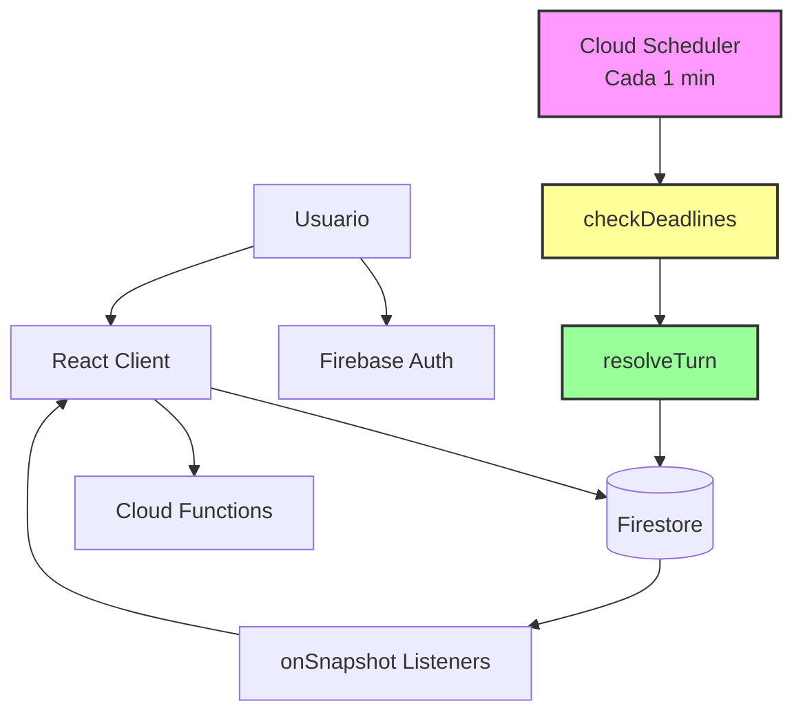
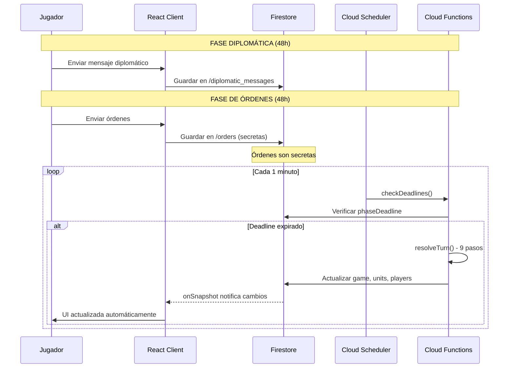
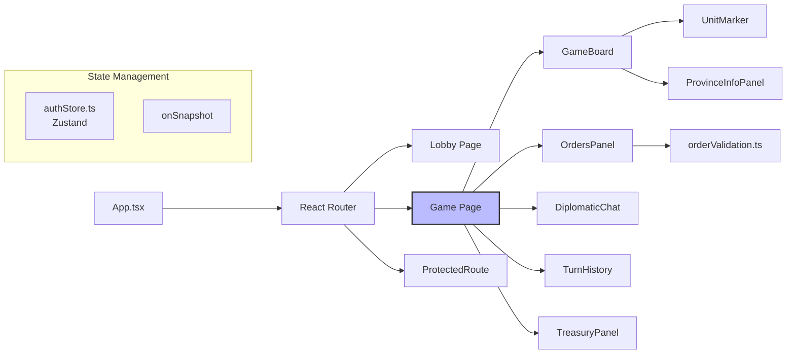
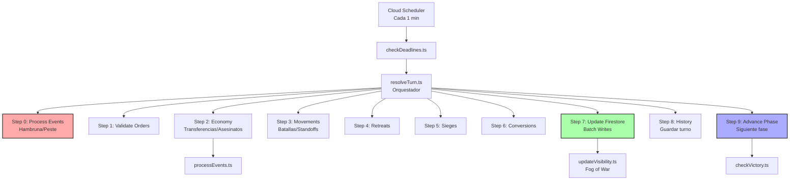
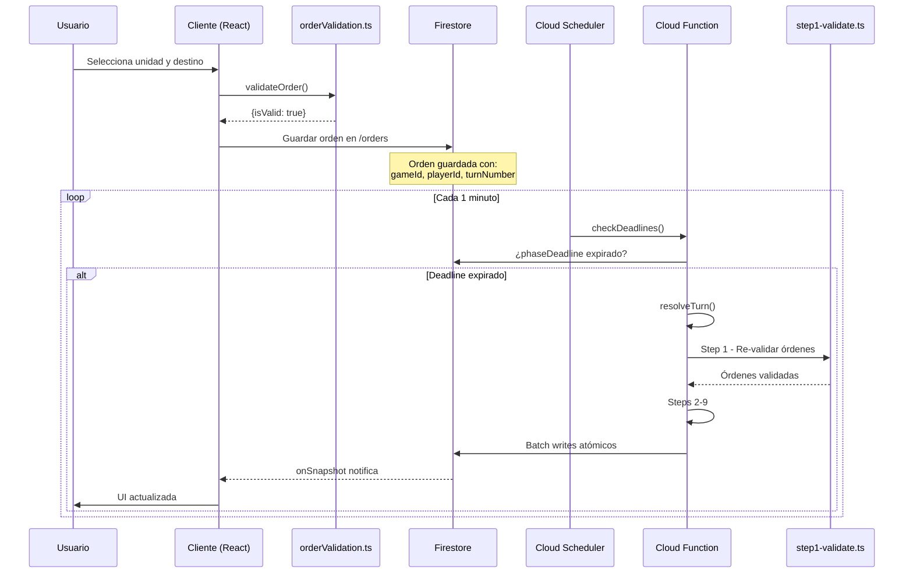

# Arquitectura del Proyecto Machiavelli

## Visión General

Machiavelli es un juego de estrategia por turnos asíncrono basado en un sistema de **deadlines temporales** (estilo "play-by-mail"). Los jugadores envían sus órdenes durante ventanas de tiempo específicas, y el servidor resuelve automáticamente los turnos cuando expira el deadline mediante Cloud Functions programadas.

**Característica clave:** El juego NO es en tiempo real. Cada fase tiene un deadline (típicamente 48 horas), y el servidor ejecuta la resolución automáticamente cuando el tiempo se agota.

## Diagrama de Arquitectura General



## Stack Tecnológico

### Frontend

| Tecnología | Versión | Propósito |
|-----------|---------|-----------|
| **React** | 19.2.0 | UI framework |
| **TypeScript** | 5.9.3 | Type safety |
| **Vite** | 7.1.9 | Build tool y dev server |
| **Tailwind CSS** | 4.1.14 | Styling utility-first |
| **React Router** | 7.9.4 | Routing SPA |
| **Zustand** | 5.0.8 | State management global |
| **react-zoom-pan-pinch** | 3.7.0 | Mapa interactivo |

### Backend

| Servicio | Propósito |
|---------|-----------|
| **Firebase Authentication** | Autenticación de usuarios |
| **Cloud Firestore** | Base de datos NoSQL en tiempo real |
| **Cloud Functions** | Lógica servidor (Node.js 20) |
| **Cloud Scheduler** | Cron jobs (checkDeadlines cada 1 minuto) |
| **Firebase Hosting** | Hosting estático del frontend |

### Desarrollo

- **Firebase Emulators** - Desarrollo local (Firestore, Auth, Functions)
- **ESLint + TypeScript** - Code quality y type checking

## Arquitectura Cliente-Servidor

### Flujo Asíncrono (Play-by-Mail)

El sistema funciona con un modelo asíncrono donde los jugadores tienen ventanas de tiempo para enviar órdenes:



**Flujo detallado:**

1. **Jugador autenticado** → Firebase Auth valida identidad
2. **React suscribe a Firestore** → `onSnapshot` listeners en tiempo real
3. **Cloud Scheduler ejecuta cada minuto** → Verifica deadlines
4. **Deadline expirado** → Ejecuta `resolveTurn()`
5. **Cloud Function resuelve turno** → 9 pasos de resolución
6. **Firestore actualiza** → Batch writes atómicos
7. **React recibe cambios** → onSnapshot dispara re-render
8. **UI actualizada** → Sin refresh manual

### Real-time Listeners

Patrón estándar usado en todos los componentes para suscribirse a cambios:

```typescript
useEffect(() => {
  const unsubscribe = onSnapshot(docRef, (snapshot) => {
    setData(snapshot.data())
  })
  return () => unsubscribe() // Cleanup OBLIGATORIO
}, [dependencies])
```

**Importante:**
- Siempre retornar `unsubscribe()` para evitar memory leaks
- Listeners se limpian automáticamente al desmontar componente
- Firestore notifica SOLO cambios relevantes (no todo el documento)

## Componentes Principales

### Frontend Architecture



**Jerarquía de componentes:**

- **App.tsx** - Root component, routing
- **Lobby.tsx** - Lista de partidas, crear/unirse
  - `GamesList.tsx` - Partidas disponibles
  - `MyGamesList.tsx` - Mis partidas activas
  - `CreateGameModal.tsx` - Crear nueva partida
  - `JoinGameDialog.tsx` - Unirse a partida
- **Game.tsx** - Partida activa (componente principal)
  - `GameBoard.tsx` - Mapa SVG interactivo
    - `UnitMarker.tsx` - Marcadores de unidades
    - `ProvinceInfoPanel.tsx` - Info de provincia
  - `OrdersPanel.tsx` - Panel de órdenes
  - `DiplomaticChat.tsx` - Chat entre jugadores
  - `TurnHistory.tsx` - Historial de turnos
  - `TreasuryPanel.tsx` - Economía y gastos
  - `TurnIndicator.tsx` - Fase y deadline actual
  - `VictoryScreen.tsx` - Pantalla de victoria

### Backend Architecture



**Funciones principales:**

- **`checkDeadlines.ts`** (scheduled, cada 1 min)
  - Verifica deadlines expirados
  - Maneja jugadores inactivos
  - Envía recordatorios 24h antes

- **`resolveTurn.ts`** (internal)
  - Orquestador de 9 pasos
  - Carga todo el estado del juego
  - Ejecuta resolución completa

- **`forcePhaseAdvance.ts`** (callable, testing)
  - Avance manual de fase
  - Solo para testing/debugging

## Ciclo de Vida de un Turno

```mermaid
stateDiagram-v2
    [*] --> Diplomacy: Fase Diplomática
    Diplomacy --> Orders: Deadline expirado (48h)
    Orders --> Resolution: Deadline expirado (48h)
    Resolution --> Step0: checkDeadlines()
    Step0 --> Step1: Procesar Hambruna/Peste
    Step1 --> Step2: Validar órdenes
    Step2 --> Step3: Procesar economía
    Step3 --> Step4: Resolver movimientos
    Step4 --> Step5: Procesar retiradas
    Step5 --> Step6: Actualizar asedios
    Step6 --> Step7: Convertir provincias
    Step7 --> Step8: Escribir a Firestore
    Step8 --> Step9: Guardar historial
    Step9 --> NextPhase: Avanzar fase
    NextPhase --> Diplomacy: Turno completado
    NextPhase --> [*]: Victoria detectada

    note right of Resolution: Duración: 1-5 minutos
    note right of Diplomacy: Duración: 48 horas
    note right of Orders: Duración: 48 horas
```

**Fases del turno:**

1. **Diplomática** (48h) - Negociaciones, mensajes secretos
2. **Órdenes** (48h) - Envío de órdenes militares (secretas)
3. **Resolución** (automática) - Servidor ejecuta los 9 pasos

## Patrones Importantes

### 1. Timestamps de Firebase

**SIEMPRE usa `Timestamp` de Firebase, NO `Date` de JavaScript:**

```typescript
import { Timestamp } from 'firebase/firestore'

// ✓ CORRECTO
phaseDeadline: Timestamp.now()
phaseDeadline: Timestamp.fromDate(new Date())

// ✗ INCORRECTO (causará errores de serialización)
phaseDeadline: new Date()
```

**Razón:** Firestore usa su propio tipo `Timestamp` para consistencia entre cliente y servidor.

### 2. Real-time Listeners con Cleanup

```typescript
useEffect(() => {
  const gameRef = doc(db, 'games', gameId)

  const unsubscribe = onSnapshot(gameRef, (snapshot) => {
    setGame(snapshot.data() as Game)
  })

  // OBLIGATORIO: Cleanup al desmontar
  return () => unsubscribe()
}, [gameId])
```

**Importante:**
- Sin cleanup → memory leaks
- Listeners activos consumen cuota de Firestore
- Re-ejecutar effect cuando cambien dependencias

### 3. Validación Dual (Cliente + Servidor)

**Cliente** (`src/utils/orderValidation.ts`) - UX inmediata:
```typescript
export function validateOrder(
  map: GameMap,
  order: Order,
  unit: Unit,
  allUnits: Unit[]
): ValidationResult {
  // Validación rápida para feedback instantáneo
  if (unit.type === 'garrison') {
    return { isValid: false, error: 'Las guarniciones no pueden moverse' }
  }
  // ...
}
```

**Servidor** (`functions/src/resolution/step1-validate.ts`) - Autoridad:
```typescript
export async function validateOrders(context: ResolutionContext): Promise<void> {
  // Validación definitiva con contexto completo
  for (const order of context.orders) {
    const validation = validateOrder(context.map, order, unit, context.units)
    if (!validation.isValid) {
      order.action = 'hold' // Cambiar a "Mantener"
      context.events.push({ type: 'invalid_order', ... })
    }
  }
}
```

**⚠️ CRÍTICO:** Ambas validaciones deben estar sincronizadas.
Ver [CODE_SYNCHRONIZATION.md](../dev/CODE_SYNCHRONIZATION.md) para detalles.

### 4. Security Rules (Read-Only Game State)

Durante partida activa (`status: 'active'`):

| Colección | Jugadores | Cloud Functions |
|-----------|-----------|-----------------|
| `games` | **Read-only** | Read/Write |
| `units` | **Read-only** (fog of war) | Read/Write |
| `players` | **Read-only** | Read/Write |
| `orders` | **Write** (solo propias) | Read/Write |
| `diplomatic_messages` | **Write** | Read |

Durante lobby (`status: 'waiting'`):
- Jugadores pueden crear/actualizar su documento en `players`
- Jugadores pueden actualizar contador en `games.playersCount`

**Principio:** Solo Cloud Functions modifican el estado del juego. Jugadores solo envían órdenes.

### 5. Path Alias

```typescript
// Configurado en vite.config.ts
import { Game } from '@/types'
import { db } from '@/lib/firebase'
import { PROVINCE_INFO } from '@/data/provinceData'
```

`@` → `/src` (root del frontend)

## Flujo de Datos Completo

### Ejemplo: Jugador envía orden de Avanzar



**Paso a paso:**

1. **Cliente**: Jugador selecciona unidad en mapa y destino
2. **Cliente**: `orderValidation.ts` valida instantáneamente (UX)
3. **Cliente**: Si válida, guarda en Firestore `/orders/{orderId}`
4. **Firestore**: Orden guardada con `gameId`, `playerId`, `turnNumber`
5. **Scheduler**: Cada minuto ejecuta `checkDeadlines()`
6. **checkDeadlines**: Verifica si `phaseDeadline <= now`
7. **resolveTurn**: Ejecuta 9 pasos de resolución
8. **Step 1**: Re-valida orden en servidor (autoridad)
9. **Step 3**: Resuelve movimiento (batallas, standoffs)
10. **Step 7**: Actualiza Firestore con batch writes
11. **Firestore**: Notifica cambios vía `onSnapshot`
12. **Cliente**: React actualiza UI automáticamente

## Fog of War y Visibilidad

Sistema de visibilidad basado en campo `visibleTo` en unidades:

```typescript
interface Unit {
  id: string
  gameId: string
  owner: string
  province: string
  type: 'army' | 'fleet' | 'garrison'
  visibleTo: string[] // ['florence', 'venice'] o ['all']
  // ...
}
```

**Reglas de visibilidad:**

1. **Unidad siempre visible** a su owner
2. **Visible a facciones adyacentes** (provincias vecinas)
3. **Guarniciones** solo visibles si controlas la provincia
4. **Después de batalla** → Unidad revelada a todos los participantes
5. **Actualizado en `updateVisibility()`** después de cada turno

**Security rules:**
```javascript
allow read: if isAuthenticated() && (
  get(/databases/$(database)/documents/games/$(resource.data.gameId)).data.status == 'waiting' ||
  (!('visibleTo' in resource.data)) ||
  (request.auth.uid in resource.data.visibleTo)
);
```

## Gestión de Eventos Especiales

### Hambruna (Spring - Primavera)

Ocurre si jugador no puede pagar mantenimiento de tropas:

```typescript
// Step 0: processEvents.ts
if (season === 'Primavera') {
  // Verificar provincias con fondos insuficientes
  // Licenciar tropas automáticamente
  // Marcar provincia con hambruna
}
```

### Peste (Summer - Verano)

Evento aleatorio en provincias con alta población:

```typescript
if (season === 'Verano' && gameData.eventsConfig?.plague) {
  // Probabilidad: 1/6 en ciudades grandes
  // Destruye guarniciones
  // Reduce ingresos temporalmente
}
```

### Asesinatos

Orden especial con coste en ducados:

```typescript
// Step 2: economy.ts
extraExpense: {
  type: 'assassination',
  target: 'player-id',
  cost: 12 | 24 | 36, // Según números elegidos
  selectedNumbers: [1, 3, 5], // 1-3 números
  diceRoll: Math.floor(Math.random() * 6) + 1,
  success: selectedNumbers.includes(diceRoll)
}
```

Ver [eventos-especiales.md](./eventos-especiales.md) para detalles completos.

## Escalabilidad y Performance

### Batch Writes

```typescript
// Step 7: Update
const batch = db.batch()

// Máximo 500 operaciones por batch
batch.update(gameRef, gameUpdates)
batch.set(unitRef, unitData)
batch.delete(oldOrderRef)

await batch.commit() // Atómico
```

**Límites de Firestore:**
- 500 operaciones por batch
- 20,000 writes/segundo por base de datos
- 10 MB por documento

### Índices Compuestos

Ver `firestore.indexes.json`:

```json
{
  "collectionGroup": "games",
  "fields": [
    { "fieldPath": "status", "order": "ASCENDING" },
    { "fieldPath": "createdAt", "order": "DESCENDING" }
  ]
}
```

**Índices necesarios:**
- `games`: status + createdAt
- `players`: gameId + joinedAt
- `units`: gameId + owner
- `orders`: gameId + turnNumber
- `diplomaticMessages`: gameId + sentAt

### Timeouts

Cloud Functions configuradas con:
```typescript
export const resolveTurn = onCall({
  timeoutSeconds: 540, // 9 minutos
  memory: '512MB'
}, async (request) => { ... })
```

**Por qué 9 minutos:**
- Partidas grandes pueden tener 100+ unidades
- Resolución de batallas complejas
- Batch writes múltiples
- Margen de seguridad

## Testing

### Emulators (Desarrollo Local)

```bash
firebase emulators:start --only firestore,auth,functions
```

**Puertos:**
- Firestore UI: http://localhost:4000
- Firestore: http://localhost:8080
- Auth: http://localhost:9099
- Functions: http://localhost:5001

### Testing Manual

1. Crear partida en lobby
2. Unirse con múltiples usuarios (ventanas incógnito)
3. Usar botón "⚡ Forzar Avance" (`forcePhaseAdvance`)
4. Verificar resolución en Emulator UI
5. Revisar logs en consola de Functions

### Callable Function (Testing)

```typescript
import { httpsCallable } from 'firebase/functions'

const forceAdvance = httpsCallable(functions, 'forcePhaseAdvance')
await forceAdvance({ gameId: 'game-id' })
```

## Deployment

**Orden recomendado:**

```bash
# 1. Security Rules primero
firebase deploy --only firestore:rules

# 2. Índices
firebase deploy --only firestore:indexes

# 3. Functions
firebase deploy --only functions

# 4. Hosting último
npm run build
firebase deploy --only hosting
```

**Requiere:** Plan Blaze para Cloud Functions en producción.

## Monitoreo

Ver [MONITORING.md](../ops/MONITORING.md) para:
- Métricas de Cloud Functions
- Alertas de errores
- Cuotas de Firestore
- Logs centralizados

## Referencias

- **[Base de Datos](./database.md)** - Esquema Firestore completo
- **[API Reference](../dev/API_REFERENCE.md)** - Cloud Functions detalladas
- **[Glosario](./glosario.md)** - Terminología técnica
- **[CODE_SYNCHRONIZATION.md](../dev/CODE_SYNCHRONIZATION.md)** - Sincronización frontend/backend
