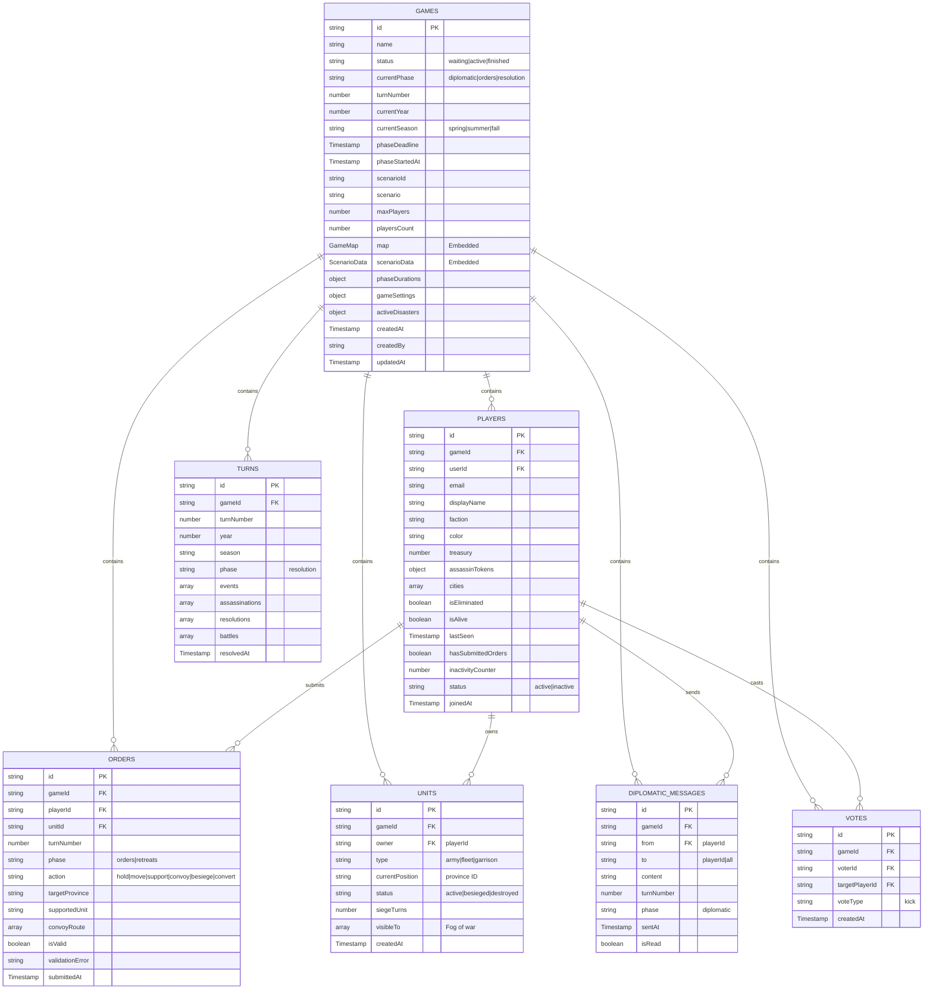

# Esquema de Base de Datos - Firestore

## Visión General

Machiavelli usa Firestore con arquitectura **flat** (no colecciones anidadas). Todas las relaciones se manejan mediante el campo `gameId`.

**Principios de diseño:**
- Colecciones planas para escalabilidad
- Relaciones mediante gameId
- Denormalización controlada (map y scenarioData embebidos en Game)
- Security rules granulares por colección

## Diagrama Entidad-Relación



## Colecciones Detalladas

### 1. /games/{gameId}

**Propósito:** Estado global del juego, fase actual, deadline, y configuración completa del mapa.

**Campos:**

| Campo | Tipo | Descripción | Obligatorio |
|-------|------|-------------|-------------|
| `id` | string | ID del juego | ✅ |
| `name` | string | Nombre opcional de la partida | ❌ |
| `status` | string | Estado: `waiting`, `active`, `finished` | ✅ |
| `currentPhase` | string | Fase: `diplomatic`, `orders`, `resolution` | ✅ |
| `turnNumber` | number | Número de turno (1-based) | ✅ |
| `currentYear` | number | Año del juego (ej: 1454) | ✅ |
| `currentSeason` | string | Estación: `spring`, `summer`, `fall` | ✅ |
| `phaseDeadline` | Timestamp | Deadline de fase actual | ✅ |
| `phaseStartedAt` | Timestamp | Cuándo empezó la fase | ✅ |
| `scenarioId` | string | ID del escenario | ✅ |
| `scenario` | string | Nombre del escenario | ✅ |
| `maxPlayers` | number | Máximo de jugadores | ✅ |
| `playersCount` | number | Jugadores unidos actualmente | ✅ |
| `map` | GameMap | Mapa completo (embebido) | ✅ |
| `scenarioData` | ScenarioData | Datos del escenario (embebido) | ✅ |
| `phaseDurations` | object | Duraciones en horas | ✅ |
| `gameSettings` | object | Configuración de reglas | ✅ |
| `activeDisasters` | object | Desastres activos (hambruna) | ❌ |
| `createdAt` | Timestamp | Fecha de creación | ✅ |
| `createdBy` | string | User ID del creador | ✅ |
| `updatedAt` | Timestamp | Última actualización | ✅ |

**Ejemplo completo:**
```json
{
  "id": "game-abc123",
  "name": "Partida Italia 1454",
  "status": "active",
  "currentPhase": "orders",
  "turnNumber": 3,
  "currentYear": 1454,
  "currentSeason": "summer",
  "phaseDeadline": Timestamp(2025-01-15 14:00:00),
  "phaseStartedAt": Timestamp(2025-01-13 14:00:00),
  "scenarioId": "ITALIA_1454",
  "scenario": "Italia 1454 - Paz de Lodi",
  "maxPlayers": 6,
  "playersCount": 5,
  "map": {
    "provinces": {
      "FLO": {
        "id": "FLO",
        "name": "Florence",
        "type": "land",
        "adjacencies": ["PIS", "PIT", "BOL", "URB", "ARE", "SIE"],
        "hasCity": true,
        "cityName": "Florence",
        "income": 5
      }
      // ... 73 provincias más
    },
    "adjacencies": {
      "FLO": ["PIS", "PIT", "BOL", "URB", "ARE", "SIE"]
      // ... resto de adyacencias
    }
  },
  "scenarioData": {
    "availableFactions": ["FLORENCE", "VENICE", "MILAN", "NAPLES", "PAPAL", "FRANCE"],
    "neutralTerritories": ["COR", "SAR", "TUR", "SALZ", "MON", "AVI", "TUN", "SWI"],
    "victoryConditions": {
      "citiesRequired": { "5": 8, "6": 9 },
      "timeLimit": 12
    },
    "factionSetups": [...]
  },
  "phaseDurations": {
    "diplomatic": 48,
    "orders": 48,
    "resolution": 1
  },
  "gameSettings": {
    "advancedRules": true,
    "optionalRules": {
      "famine": true,
      "plague": true,
      "assassination": true
    },
    "emailNotifications": true
  },
  "activeDisasters": {
    "famineProvinces": ["PISA", "LUCCA"]
  },
  "createdAt": Timestamp(2025-01-10 10:00:00),
  "createdBy": "user-xyz789",
  "updatedAt": Timestamp(2025-01-13 14:00:00)
}
```

**Índices:**
- `status + createdAt` (compuesto) - Para listar juegos activos ordenados

**Security Rules:**
- **Read**: Authenticated users
- **Create**: Authenticated users (status debe ser 'waiting')
- **Update**: Solo si status='waiting' OR Cloud Functions (admin)

**Nota importante:**
- `map` y `scenarioData` se copian del escenario al crear la partida
- Esto permite modificaciones dinámicas durante el juego
- Evita dependencia de colección `scenarios` durante partida activa

---

### 2. /players/{playerId}

**Propósito:** Estado del jugador: tesoro, facción, ciudades, actividad.

**Campos:**

| Campo | Tipo | Descripción | Obligatorio |
|-------|------|-------------|-------------|
| `id` | string | ID del jugador | ✅ |
| `gameId` | string | ID del juego | ✅ |
| `userId` | string | User ID de Firebase Auth | ✅ |
| `email` | string | Email del jugador | ✅ |
| `displayName` | string | Nombre visible | ✅ |
| `faction` | string | Facción elegida | ✅ |
| `color` | string | Color hex de la facción | ✅ |
| `treasury` | number | Ducados actuales | ✅ |
| `assassinTokens` | object | Fichas de asesino por jugador | ❌ |
| `cities` | array | IDs de ciudades controladas | ✅ |
| `isEliminated` | boolean | Eliminado del juego | ✅ |
| `isAlive` | boolean | Jugador activo | ✅ |
| `lastSeen` | Timestamp | Última actividad | ✅ |
| `hasSubmittedOrders` | boolean | Órdenes enviadas este turno | ✅ |
| `inactivityCounter` | number | Turnos consecutivos sin órdenes | ❌ |
| `status` | string | Estado: `active`, `inactive` | ❌ |
| `joinedAt` | Timestamp | Fecha de unión | ✅ |

**Ejemplo:**
```json
{
  "id": "player-def456",
  "gameId": "game-abc123",
  "userId": "user-xyz789",
  "email": "player@example.com",
  "displayName": "Lorenzo de Medici",
  "faction": "FLORENCE",
  "color": "#22c55e",
  "treasury": 150,
  "assassinTokens": {
    "player-ghi789": 2,
    "player-jkl012": 1
  },
  "cities": ["FLO", "PER", "ARE"],
  "isEliminated": false,
  "isAlive": true,
  "lastSeen": Timestamp(2025-01-15 13:45:00),
  "hasSubmittedOrders": true,
  "inactivityCounter": 0,
  "status": "active",
  "joinedAt": Timestamp(2025-01-10 10:30:00)
}
```

**Índices:**
- `gameId + joinedAt` (compuesto) - Para listar jugadores de un juego

**Security Rules:**
- **Read**: Jugadores del mismo gameId
- **Create**: Authenticated users (solo en lobby)
- **Update**: READ-ONLY durante juego activo (solo Cloud Functions)
  - Excepción: jugadores pueden actualizar `lastSeen`

---

### 3. /units/{unitId}

**Propósito:** Unidades militares (ejércitos, flotas, guarniciones).

**Campos:**

| Campo | Tipo | Descripción | Obligatorio |
|-------|------|-------------|-------------|
| `id` | string | ID de la unidad | ✅ |
| `gameId` | string | ID del juego | ✅ |
| `owner` | string | Player ID propietario | ✅ |
| `type` | string | Tipo: `army`, `fleet`, `garrison` | ✅ |
| `currentPosition` | string | ID de la provincia | ✅ |
| `status` | string | Estado: `active`, `besieged`, `destroyed` | ✅ |
| `siegeTurns` | number | Progreso de asedio (0-2) | ❌ |
| `visibleTo` | array | Player IDs que ven esta unidad (fog of war) | ❌ |
| `createdAt` | Timestamp | Fecha de creación | ✅ |

**Ejemplo:**
```json
{
  "id": "unit-ghi789",
  "gameId": "game-abc123",
  "owner": "player-def456",
  "type": "army",
  "currentPosition": "PISA",
  "status": "active",
  "siegeTurns": 0,
  "visibleTo": ["player-def456", "player-abc123", "player-xyz456"],
  "createdAt": Timestamp(2025-01-10 10:30:00)
}
```

**Índices:**
- `gameId + owner` (compuesto) - Para listar unidades de un jugador

**Security Rules:**
- **Read**: Solo si la unidad es visible (`visibleTo` incluye tu playerId o es lobby)
- **Write**: READ-ONLY (solo Cloud Functions)

**Fog of War:**
- `visibleTo` se actualiza después de cada turno en `updateVisibility()`
- Unidad visible a:
  - Su owner siempre
  - Jugadores con unidades en provincias adyacentes
  - Jugadores que participaron en batalla con esta unidad
- Guarniciones solo visibles si controlas la provincia

---

### 4. /orders/{orderId}

**Propósito:** Órdenes secretas de los jugadores.

**Campos:**

| Campo | Tipo | Descripción | Obligatorio |
|-------|------|-------------|-------------|
| `id` | string | ID de la orden | ✅ |
| `gameId` | string | ID del juego | ✅ |
| `playerId` | string | ID del jugador | ✅ |
| `unitId` | string | ID de la unidad | ✅ |
| `turnNumber` | number | Turno de la orden | ✅ |
| `phase` | string | Fase: `orders`, `retreats` | ✅ |
| `action` | string | Tipo: `hold`, `move`, `support`, `convoy`, `besiege`, `convert` | ✅ |
| `targetProvince` | string | Provincia destino (para move, besiege) | ❌ |
| `supportedUnit` | string | Unidad apoyada (para support, convoy) | ❌ |
| `convoyRoute` | array | Ruta de convoy (para convoy) | ❌ |
| `isValid` | boolean | Orden validada por servidor | ❌ |
| `validationError` | string | Error de validación | ❌ |
| `submittedAt` | Timestamp | Fecha de envío | ✅ |

**Ejemplo - Orden de Movimiento:**
```json
{
  "id": "order-jkl012",
  "gameId": "game-abc123",
  "playerId": "player-def456",
  "unitId": "unit-ghi789",
  "turnNumber": 3,
  "phase": "orders",
  "action": "move",
  "targetProvince": "LUCCA",
  "isValid": true,
  "submittedAt": Timestamp(2025-01-15 13:30:00)
}
```

**Ejemplo - Orden de Apoyo:**
```json
{
  "id": "order-mno345",
  "gameId": "game-abc123",
  "playerId": "player-def456",
  "unitId": "unit-pqr678",
  "turnNumber": 3,
  "phase": "orders",
  "action": "support",
  "supportedUnit": "unit-ghi789",
  "targetProvince": "LUCCA",
  "isValid": true,
  "submittedAt": Timestamp(2025-01-15 13:32:00)
}
```

**Índices:**
- `gameId + turnNumber` (compuesto) - Para cargar órdenes de un turno

**Security Rules:**
- **Read**: Solo owner durante fase orders/retreats; todos después de resolución
- **Write**: Solo owner, solo durante fase correcta
- **Delete**: READ-ONLY (solo Cloud Functions)

**Nota:** Las órdenes son **secretas** hasta que se resuelve el turno. Esto es fundamental para la estrategia del juego.

---

### 5. /diplomatic_messages/{messageId}

**Propósito:** Mensajes diplomáticos entre jugadores.

**Campos:**

| Campo | Tipo | Descripción | Obligatorio |
|-------|------|-------------|-------------|
| `id` | string | ID del mensaje | ✅ |
| `gameId` | string | ID del juego | ✅ |
| `from` | string | Player ID emisor | ✅ |
| `to` | string | Player ID receptor o 'all' | ✅ |
| `content` | string | Contenido del mensaje | ✅ |
| `turnNumber` | number | Turno en que se envió | ✅ |
| `phase` | string | Fase: `diplomatic` | ✅ |
| `sentAt` | Timestamp | Fecha de envío | ✅ |
| `isRead` | boolean | Mensaje leído | ❌ |

**Ejemplo - Mensaje privado:**
```json
{
  "id": "msg-mno345",
  "gameId": "game-abc123",
  "from": "player-def456",
  "to": "player-abc123",
  "content": "Propongo alianza contra Milán. Te apoyo en Verona si me apoyas en Lucca.",
  "turnNumber": 3,
  "phase": "diplomatic",
  "sentAt": Timestamp(2025-01-15 12:00:00),
  "isRead": false
}
```

**Ejemplo - Mensaje público:**
```json
{
  "id": "msg-pqr678",
  "gameId": "game-abc123",
  "from": "player-def456",
  "to": "all",
  "content": "Florencia propone paz general por 2 turnos.",
  "turnNumber": 3,
  "phase": "diplomatic",
  "sentAt": Timestamp(2025-01-15 12:05:00),
  "isRead": false
}
```

**Índices:**
- `gameId + sentAt` (compuesto) - Para ordenar mensajes cronológicamente

**Security Rules:**
- **Read**: Si eres `from`, `to`, o si `to='all'`
- **Write**: Authenticated users del gameId
- **Delete**: READ-ONLY (solo Cloud Functions)

---

### 6. /votes/{voteId}

**Propósito:** Votos para expulsar jugadores inactivos.

**Campos:**

| Campo | Tipo | Descripción | Obligatorio |
|-------|------|-------------|-------------|
| `id` | string | ID del voto | ✅ |
| `gameId` | string | ID del juego | ✅ |
| `voterId` | string | ID del votante | ✅ |
| `targetPlayerId` | string | ID del jugador objetivo | ✅ |
| `voteType` | string | Tipo: `kick` | ✅ |
| `createdAt` | Timestamp | Fecha de creación | ✅ |

**Ejemplo:**
```json
{
  "id": "vote-pqr678",
  "gameId": "game-abc123",
  "voterId": "player-def456",
  "targetPlayerId": "player-stu901",
  "voteType": "kick",
  "createdAt": Timestamp(2025-01-15 11:00:00)
}
```

**Lógica de votación:**
- Requiere mayoría simple (> 50% de jugadores activos)
- Votos se procesan en `processInactiveVotes()` durante resolución
- Si aprobado: jugador marcado como `isAlive: false`

**Security Rules:**
- **Read**: Jugadores del gameId
- **Write**: Jugadores activos del gameId
- **Delete**: READ-ONLY (solo Cloud Functions)

---

### 7. /turns/{turnId}

**Propósito:** Historial de turnos resueltos.

**Campos:**

| Campo | Tipo | Descripción | Obligatorio |
|-------|------|-------------|-------------|
| `id` | string | ID del turno | ✅ |
| `gameId` | string | ID del juego | ✅ |
| `turnNumber` | number | Número de turno | ✅ |
| `year` | number | Año del juego | ✅ |
| `season` | string | Estación | ✅ |
| `phase` | string | Fase resuelta | ✅ |
| `events` | array | Eventos del turno | ❌ |
| `assassinations` | array | Intentos de asesinato | ❌ |
| `resolutions` | array | Resoluciones de órdenes | ❌ |
| `battles` | array | Batallas ocurridas | ❌ |
| `resolvedAt` | Timestamp | Fecha de resolución | ✅ |

**Ejemplo:**
```json
{
  "id": "turn-vwx234",
  "gameId": "game-abc123",
  "turnNumber": 3,
  "year": 1454,
  "season": "summer",
  "phase": "orders",
  "events": [
    {
      "type": "famine",
      "affectedProvinces": ["SIENA"],
      "unitsDestroyed": ["unit-abc123"]
    }
  ],
  "assassinations": [
    {
      "attacker": "player-def456",
      "victim": "player-ghi789",
      "cost": 24,
      "selectedNumbers": [2, 4],
      "diceRoll": 4,
      "success": true,
      "effects": {
        "ordersNullified": 3,
        "garrisonsDestroyed": [],
        "rebellions": []
      }
    }
  ],
  "resolutions": [
    {
      "unitId": "unit-ghi789",
      "action": "move",
      "result": "success",
      "details": "Army moved from PISA to LUCCA"
    }
  ],
  "battles": [
    {
      "province": "LUCCA",
      "attackers": ["unit-ghi789"],
      "defenders": ["unit-jkl012"],
      "winner": "player-def456",
      "retreats": ["unit-jkl012"]
    }
  ],
  "resolvedAt": Timestamp(2025-01-15 14:01:00)
}
```

**Security Rules:**
- **Read**: Jugadores del gameId
- **Write**: READ-ONLY (solo Cloud Functions)

**Uso:** Componente `TurnHistory.tsx` muestra este historial para revisar turnos pasados.

---

## Relaciones

### Por gameId (Todas las colecciones)

```typescript
// Obtener todos los jugadores de un juego
const playersQuery = query(
  collection(db, 'players'),
  where('gameId', '==', gameId)
)

// Obtener todas las unidades de un juego
const unitsQuery = query(
  collection(db, 'units'),
  where('gameId', '==', gameId)
)
```

### Por owner (Units)

```typescript
// Obtener unidades de un jugador específico
const myUnitsQuery = query(
  collection(db, 'units'),
  where('gameId', '==', gameId),
  where('owner', '==', playerId)
)
```

### Por turnNumber (Orders)

```typescript
// Obtener órdenes del turno actual
const ordersQuery = query(
  collection(db, 'orders'),
  where('gameId', '==', gameId),
  where('turnNumber', '==', currentTurn)
)
```

---

## Índices Compuestos

Definidos en `firestore.indexes.json`:

```json
{
  "indexes": [
    {
      "collectionGroup": "games",
      "queryScope": "COLLECTION",
      "fields": [
        { "fieldPath": "status", "order": "ASCENDING" },
        { "fieldPath": "createdAt", "order": "DESCENDING" }
      ]
    },
    {
      "collectionGroup": "players",
      "queryScope": "COLLECTION",
      "fields": [
        { "fieldPath": "gameId", "order": "ASCENDING" },
        { "fieldPath": "joinedAt", "order": "DESCENDING" }
      ]
    },
    {
      "collectionGroup": "units",
      "queryScope": "COLLECTION",
      "fields": [
        { "fieldPath": "gameId", "order": "ASCENDING" },
        { "fieldPath": "owner", "order": "ASCENDING" }
      ]
    },
    {
      "collectionGroup": "orders",
      "queryScope": "COLLECTION",
      "fields": [
        { "fieldPath": "gameId", "order": "ASCENDING" },
        { "fieldPath": "turnNumber", "order": "ASCENDING" }
      ]
    },
    {
      "collectionGroup": "diplomaticMessages",
      "queryScope": "COLLECTION",
      "fields": [
        { "fieldPath": "gameId", "order": "ASCENDING" },
        { "fieldPath": "sentAt", "order": "DESCENDING" }
      ]
    }
  ]
}
```

**Por qué son necesarios:**
- Firestore requiere índices para queries con múltiples campos
- Sin índices → Error: "Index required"
- Click en link del error para crearlos automáticamente

---

## Security Rules

Ver `firestore.rules` para reglas completas.

### Principios Clave

1. **Games/Units/Players son READ-ONLY durante juego activo**
   - Solo Cloud Functions (Admin SDK) pueden modificar
   - Previene cheating y manipulación del estado

2. **Orders son secretas durante fase de órdenes**
   - Solo el owner puede leer sus propias órdenes
   - Visibles a todos después de resolución
   - Fundamental para la estrategia del juego

3. **Fog of War en Units**
   - Campo `visibleTo` controla visibilidad
   - Security rules verifican que tu playerId esté en `visibleTo`
   - Durante lobby, todas las unidades son visibles

4. **Lobby es más permisivo**
   - Jugadores pueden unirse/salir
   - Jugadores pueden actualizar ready status
   - Necesario para setup de partida

**Ejemplo de security rule (Units con fog of war):**

```javascript
match /units/{unitId} {
  allow read: if isAuthenticated() && (
    get(/databases/$(database)/documents/games/$(resource.data.gameId)).data.status == 'waiting' ||
    (!('visibleTo' in resource.data)) ||
    (request.auth.uid in resource.data.visibleTo)
  );

  allow create, update: if isAuthenticated() &&
    get(/databases/$(database)/documents/games/$(request.resource.data.gameId)).data.status == 'waiting';

  allow delete: if false;
}
```

---

## Migraciones

⚠️ **No hay sistema de migraciones automáticas.**

Para cambios de esquema:

1. Actualizar tipos en `src/types/game.ts` y `functions/src/types.ts`
2. Actualizar security rules en `firestore.rules`
3. Actualizar índices en `firestore.indexes.json`
4. Desplegar:
   ```bash
   firebase deploy --only firestore:rules,firestore:indexes
   ```
5. Migración manual de datos existentes (si necesario)

**Estrategia de compatibilidad:**
- Nuevos campos opcionales (`?` en TypeScript)
- Valores por defecto en código
- Backwards compatibility en reads

---

## Queries Comunes

### Listar juegos activos

```typescript
const activeGamesQuery = query(
  collection(db, 'games'),
  where('status', '==', 'active'),
  orderBy('createdAt', 'desc')
)

const snapshot = await getDocs(activeGamesQuery)
const games = snapshot.docs.map(doc => ({ id: doc.id, ...doc.data() }))
```

### Obtener mis partidas

```typescript
// Primero obtener mis players
const myPlayersQuery = query(
  collection(db, 'players'),
  where('userId', '==', currentUser.uid),
  where('isAlive', '==', true)
)

const playersSnapshot = await getDocs(myPlayersQuery)
const gameIds = playersSnapshot.docs.map(doc => doc.data().gameId)

// Luego cargar los juegos
const myGames = await Promise.all(
  gameIds.map(id => getDoc(doc(db, 'games', id)))
)
```

### Real-time game state

```typescript
// Suscribirse a cambios del juego
useEffect(() => {
  const gameRef = doc(db, 'games', gameId)

  const unsubscribe = onSnapshot(gameRef, (snapshot) => {
    setGame(snapshot.data() as Game)
  })

  return () => unsubscribe() // Cleanup obligatorio
}, [gameId])
```

### Cargar órdenes del turno actual

```typescript
const ordersQuery = query(
  collection(db, 'orders'),
  where('gameId', '==', gameId),
  where('turnNumber', '==', currentTurn),
  where('playerId', '==', myPlayerId)
)

const snapshot = await getDocs(ordersQuery)
const myOrders = snapshot.docs.map(doc => ({ id: doc.id, ...doc.data() }))
```

---

## Performance

### Batch Writes

Máximo **500 operaciones** por batch:

```typescript
const batch = db.batch()

// Actualizar juego
batch.update(gameRef, gameUpdates)

// Crear nueva unidad
batch.set(unitRef, unitData)

// Eliminar orden antigua
batch.delete(orderRef)

await batch.commit() // Atómico
```

**Importante:**
- Batch writes son atómicos (todo o nada)
- Máximo 500 operaciones por batch
- Si falla una, todas fallan

### Pagination

Para listas largas:

```typescript
const gamesQuery = query(
  collection(db, 'games'),
  orderBy('createdAt', 'desc'),
  limit(20)
)

const snapshot = await getDocs(gamesQuery)
const lastVisible = snapshot.docs[snapshot.docs.length - 1]

// Siguiente página
const nextQuery = query(
  collection(db, 'games'),
  orderBy('createdAt', 'desc'),
  startAfter(lastVisible),
  limit(20)
)
```

### Listeners Cleanup

**SIEMPRE limpia listeners:**

```typescript
useEffect(() => {
  const unsubscribe = onSnapshot(docRef, callback)
  return () => unsubscribe() // Evita memory leaks
}, [dependencies])
```

**Consecuencias de no limpiar:**
- Memory leaks
- Listeners zombies consumiendo cuota
- Performance degradada

---

## Límites de Firestore

**Plan Blaze (Production):**
- 50,000 reads/día (gratis)
- 20,000 writes/día (gratis)
- 20,000 deletes/día (gratis)
- Después: $0.06 / 100,000 reads

**Límites técnicos:**
- 10 MB por documento
- 500 operaciones por batch
- 20,000 writes/segundo por base de datos
- 1 MB/segundo por documento

Ver [Firebase pricing](https://firebase.google.com/pricing) para detalles actualizados.

---

## Referencias

- **[Arquitectura](./arquitectura.md)** - Flujo completo del sistema
- **[API Reference](../dev/API_REFERENCE.md)** - Cloud Functions
- **[Security Rules](../../firestore.rules)** - Reglas completas
- **[Índices](../../firestore.indexes.json)** - Configuración de índices
